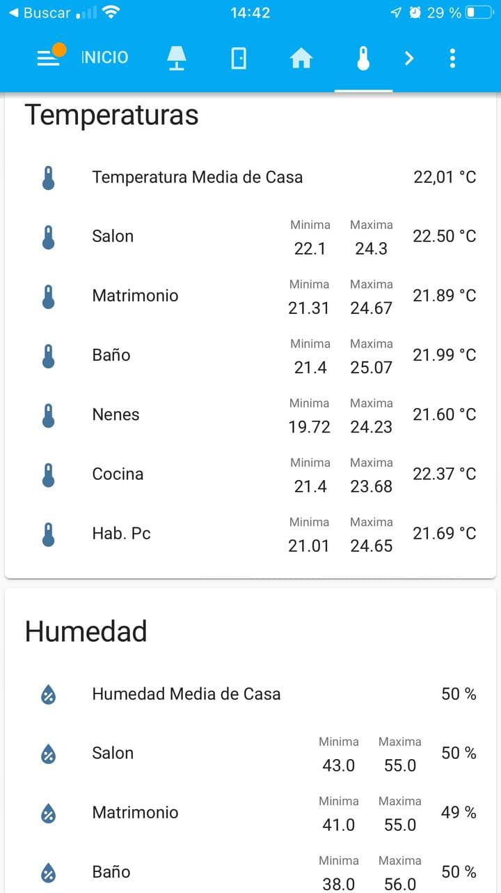

# Automatizaciones para estar mejor

¿Tienes calor?, ¿tienes frío?, uff que pereza, tengo que levantarme a enceder la calefacción, ¿dónde está el mando del aire acondicionado?, ¡Aquí huele a cerrado!, hay que ventilar, pero ¿no hay mucha humedad?, se acabó, con estas automatizaciones te tendrás que olvidar de casi todo.

## Abrir ventanas dependiendo de la humedad exterior

Si vives en una ciudad costera o con alta humedad, aqui hay un script para comparar la humedad exterior e interior de tu vivienda, para que te aconseje si abrir o no las ventanas de casa para ventilar.

??? tip "Requisitos"

    * Un altavoz multimedia configurado, que admita tts.
    * Sensores de humedad interior y exterior.

```yaml
puedo_abrir_las_ventanas:
  sequence:
  - service: tts.google_say
    data:
      entity_id: media_player.salon
      message: '" Yo no abriría. Hay un {{ (states("sensor.humedad_exterior_matrimonio")
        | int)-(states("sensor.humedad_media_casa")| int)}} Por ciento mas de Humedad
        en el exterior      Puedes abrir. Hay un {{ (states("sensor.humedad_media_casa")
        | int) -(states("sensor.humedad_exterior_matrimonio") | int) }} Por ciento
        menos de Humedad en el exterior    Puedes abrir, pero no tardes
        en cerrar. La humedad ahora en el exterior es similar al interior  "'
  mode: single
  alias: Puedo Abrir las Ventanas
  icon: mdi:window-closed-variant
```
**Variables usadas**

| Variables                   | Tipo       | Descripción                         |
| ----------------------------| -----------|-------------------------------------|
| `sensor.humedad_media_casa` | *sensor* | Humedad media de la casa, se calcula a partir de varios sensores, [más información.](http://localhost:8000/automatizaciones/confort/#media-de-temperatura-o-humedad)  |
| `sensor.humedad_exterior_matrimonio` | *sensor* | Sensor exterior de humedad  |
| `tts.google_say` | *servicio* | Servicio para que el altavoz multimedia diga la frase escrita a través de tts  |

## Media de temperatura o humedad

Sensor que saca la media de temperatura a partir de otros sensores. En este caso se divide por 5, ya que se utilizan 5 sensores para sacar la media.

??? tip "Requisitos"

    * Sensores de humedad o temperatura.

```yaml
 platform: template
    sensors:
      humedad_media_casa:
        friendly_name: Humedad Media de Casa
        unit_of_measurement: "%"
        icon_template: mdi:water-percent
        value_template: "{{ ((states('sensor.humedad_salon') | int(50) + 
                              states('sensor.humedad_h_matrimonio') | int(50) + 
                              states('sensor.humedad_h_nenes') | int(50) + 
                              states('sensor.humedad_cocina') | int(50) + 
                              states('sensor.humedad_h_pc') | int(50) ) /5) | round(0) }}"
```

## Estadísticas de un sensor

No te ha pasado nunca que te despiertas y dices, que frío y te preguntas, ¿cuanto habrá sido la temperatura mínima?, pues con **statistics** es fácil, creamos los siguiente sensores:

??? tip "Requisitos"

    * Sensores que hagan algún tipo de medición

Nos creamos el sensor de estadísticas:

```yaml
  - platform: statistics
    entity_id: sensor.temperatura_bano
    max_age:
      hours: 24
    sampling_size: 600
    precision: 2
    name: stats_temperatura_bano  

```
El **sensor.temperatura_bano** contiene dos atributos, que son la temperatura máxima y mínima, si los queremos sacar por separado:

```yaml
- platform: template
  sensors:
    bano_temp_min:
      value_template: "{{ state_attr('sensor.stats_temperatura_bano', 'min_value') }}" 
    bano_temp_max:
      value_template: "{{ state_attr('sensor.stats_temperatura_bano', 'max_value') }}"
```
Si nos queremos hacer un panel como este:

<figure markdown> 
  { width="200" }
</figure>

** Código lovelace **

```yaml
type: entities
entities:
  - entity: sensor.temperatura_media_casa
  - entity: sensor.temperatura_salon
    type: custom:multiple-entity-row
    name: Salon
    entities:
      - sensor.salon_temp_min
      - sensor.salon_temp_max
  - entity: sensor.temperatura_h_matrimonio
    type: custom:multiple-entity-row
    name: Matrimonio
    entities:
      - sensor.matrimonio_temp_min
      - sensor.matrimonio_temp_max
  - entity: sensor.temperatura_bano
    type: custom:multiple-entity-row
    name: Baño
    entities:
      - sensor.bano_temp_min
      - sensor.bano_temp_max
  - entity: sensor.temperatura_h_nenes
    type: custom:multiple-entity-row
    name: Nenes
    entities:
      - sensor.nenes_temp_min
      - sensor.nenes_temp_max
  - entity: sensor.temperatura_cocina
    type: custom:multiple-entity-row
    name: Cocina
    entities:
      - sensor.cocina_temp_min
      - sensor.cocina_temp_max
  - entity: sensor.temperatura_h_pc
    type: custom:multiple-entity-row
    name: Hab. Pc
    entities:
      - sensor.h_pc_temp_min
      - sensor.h_pc_temp_max
title: Temperaturas
```

