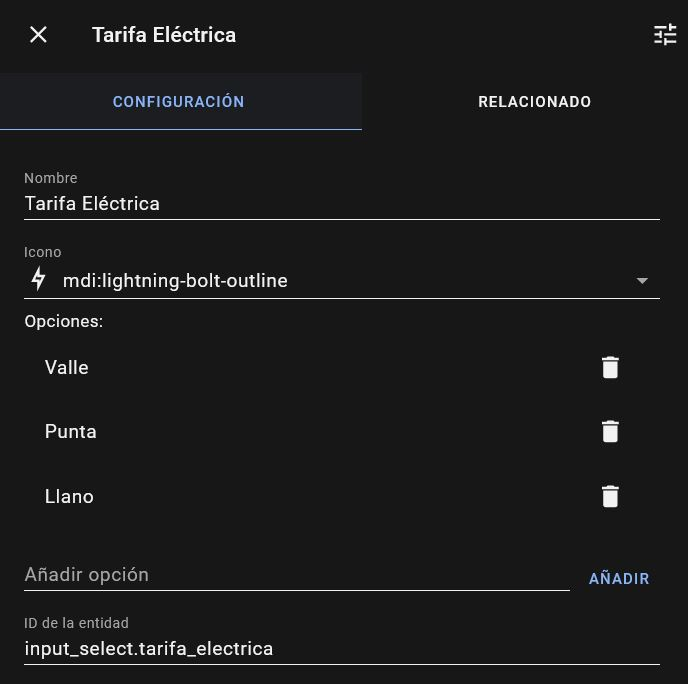
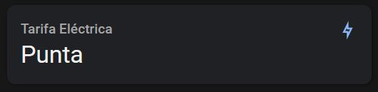

# Automatizaciones de energía

Todo tipo de automatizaciones relacionadas con la energía, que te servirán para detectar si se ha ido la luz, si ha terminado un lavavajillas o tienes el te terminado. Estas automatizaciones normalmente se ubican en el fichero **automations.yaml**

## Detectar que se ha ido la luz

Automatización para detectar que se ha ido la luz, ya sea por un corte de corriente o avería, una vez detectado el corte manda un mensaje a Telegram. Tu router y tu raspberry deberá de estar conectada a un sistema de alimentación interrumpida (SAI).

??? tip "Requisitos"

    * Un medidor de energía, normalmente un PZEM.
    * Un notificador configurado, en esta caso    <a href="https://www.home-assistant.io/integrations/telegram/" target="_blank">** Telegram **</a>
   

```yaml
- id: 'Comprobar electricidad'
  alias: Comprobar electricidad cortada
  description: >-
    Detecta si la luz se ha ido, bien por exceder el consumo máximo permitido, o
    simplemente por haberse producido una avería eléctrica en el barrio. También
    comprueba si se ha reestablecido
  trigger:
    - platform: state
      entity_id: sensor.general_consumo_instantaneo
      for: '00:00:10'
  action:
    - choose:
        - conditions:
            - condition: template
              value_template: '{{ trigger.from_state.state | float > 3300 }}'
            - condition: template
              value_template: '{{ trigger.to_state.state == "unavailable" }}'
          sequence:
            - service: notify.telegram_casa
              data:
                message: >-
                  ⚡️ La luz se ha ido en la vivienda, probablemente por exceso de
                  potencia contratada, ya que se estaban consumiendo {{
                  trigger.from_state.state }} W/h
            - service: var.set
              data:
                entity_id: var.bool_no_hay_electricidad
                value: true
        - conditions:
            - condition: template
              value_template: '{{ trigger.from_state.state | float <= 3300 }}'
            - condition: template
              value_template: '{{ trigger.to_state.state == "unavailable" }}'
          sequence:
            - service: notify.telegram_casa
              data:
                message: >-
                  ⚡️ La luz se ha ido en la vivienda, probablemente por una avería
                  en la zona
            - service: var.set
              data:
                entity_id: var.bool_no_hay_electricidad
                value: true
        - conditions:
            - condition: template
              value_template: '{{ trigger.from_state.state == "unavailable" }}'
            - condition: template
              value_template: '{{ trigger.to_state.state != "unavailable" }}'
            - condition: template
              value_template: '{{ is_state("var.bool_no_hay_electricidad", "True") }}'
          sequence:
            - service: notify.telegram_casa
              data:
                message: ⚡️ El suministro de electricidad se ha reestablecido
            - service: var.set
              data:
                entity_id: var.bool_no_hay_electricidad
                value: false
  mode: single
```
:fontawesome-brands-telegram:{ .telegram } <small> @sermayoral</small> 

## Saber en que tarifa eléctrica estás

Vas a encender tu horno para hacer la especialidad de la semana, y acabas de oir en las noticias de que el megavatio/hora está a 310€ en hora punta, (aunque si tienes tarifa regulado, esto no te afecta), ¿enciendo el horno?, ¿pero en que tarifa estoy?, llano, punta, valle, con esta automatización podrás saber dependiendo de la hora en que tarifa estas.

** Creando un ayudante **

Nos vamos a crear un ayudante de tipo input select, donde vamos a definir las tarifas, los valores son:

* Valle
* Punta
* LLano

<figure markdown> 
  { width="300" }
  <figcaption>Nos debe quedar algo así</figcaption>
</figure>

** Creando el sensor work day**

Para que los festivos nacionales se tenga en cuenta (recuerda que esos días la tarifa siempre será valle), deberás de activar este el sensor binario work day, añade las siguiente líneas en el **configuration.yaml**

```yaml
- platform: workday
  country: ES
```

** Creando automatización **

Y ahora nos creamos una atomatización, para que dependiendo de la hora nos cambie la tarifa, este sería el código:

```yaml
- id: '1623690688663'
  alias: Seleccionar Tarifa de la Luz
  description: Selecciona la tarifa de la luz
  trigger:
  - platform: time_pattern
    minutes: /5
  condition: []
  action:
  - choose:
    - conditions:
      - condition: template
        value_template: "{{(now().hour >= 10 and now().hour < 14) or \n  (now().hour\
          \ >= 18 and now().hour < 22)}}"
      - condition: state
        entity_id: binary_sensor.workday_sensor
        state: 'on'
      sequence:
      - service: input_select.select_option
        target:
          entity_id: input_select.tarifa_electrica
        data:
          option: Punta
        data:
          tariff: punta
    - conditions:
      - condition: template
        value_template: "{{ (now().hour >= 8 and now().hour < 10) or\n   (now().hour\
          \ >= 14 and now().hour < 18) or \n   (now().hour >= 22 and now().hour <=\
          \ 23)}}"
      - condition: state
        entity_id: binary_sensor.workday_sensor
        state: 'on'
      sequence:
      - service: input_select.select_option
        target:
          entity_id: input_select.tarifa_electrica
        data:
          option: Llano
        data:
          tariff: llano
    default:
    - service: input_select.select_option
      target:
        entity_id: input_select.tarifa_electrica
      data:
        option: Valle
  mode: single
```

Una vez realizado puedes mostar tu entidad en tu panel de Home Assistant:

<figure markdown> 
  { width="300" }
</figure>
