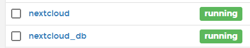
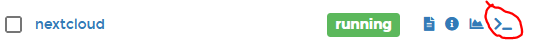
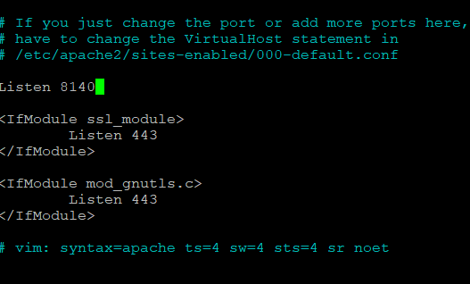
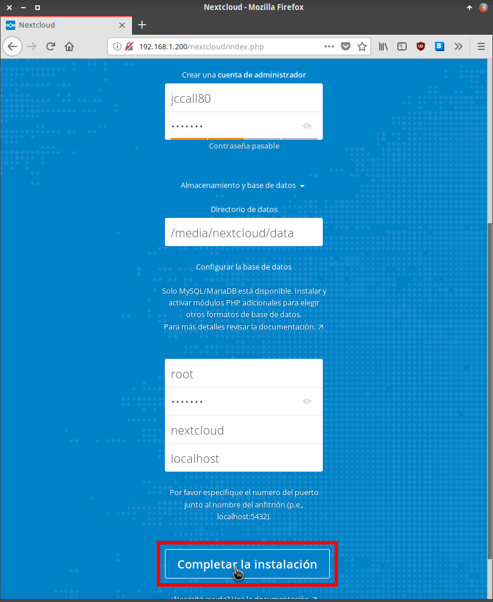

# Docker

En esta sección te desvelaremos todos los secretos para manejar docker como un pro, y perderle miedo a los comandos que harán de tu vida con docker una experiencia sencilla.

También te enseñaremos la manera de instalar todos los contendedores que harán de tu ordenador una máquina funcional y preparada para casi cualquier tarea.

## Bloquear las actualizaciones en Docker

Alguna vez, se ha reportado algún error de tal manera que cuando Docker se actualiza, este no es compatible con Home Assistant, por lo que tenemos que esperar a que Docker saque una actualización, si actualizas tu sistema Linux habitualmente y no quieres actualizar Docker hasta estar seguro de que no se produce ningún problema de compatibilidad puedes hacer que Docker no se actualize.

**Para bloquear la actualización:**

```
  sudo apt-mark hold docker-ce sudo apt-mark hold docker-cli-ce
```

**Para desbloquear la actualización:**

```
sudo apt-mark hold docker-ce sudo apt-mark hold docker-cli-ce
```

Si has tenido problemas con la versión Docker 20.10.4, ejecuta los siguientes comandos:

```
sudo nano /usr/sbin/hassio-supervisor
```

Comentamos la última línea con un # y añadimos la siguiente línea:

```
runSupervisor
```

## Crea tu propia nube privada con NextCloud

Estás harto de depender se servicios de terceros para tener tus archivos a buen puerto, estas aburrido de tener varios Google Drive con todas tus fotos y ficheros de interés, no te fías ni un pelo de los servicios de almacenamiento en la nube, NextCloud es tu respuesta, es una aplicación de software libre donde podrás tener organizados todos tus ficheros, ademas dispone de aplicación móvil y aplicación de escritorio para casi todos los sistemas operativos, vamos al lío, ¿que necesito?.

**¿Que necesito?**

* Una Raspberry Pi con Raspbian o ordenador con Linux instalado.
* Docker y docker-compose instalado.
* Portainer instalado, no es obligatorio pero recomendable.
* Una conexión a internet sin CGNAT (si quieres tener tu nube disponible desde cualquier sitio)
* Opcional - un disco duro de 2.5" o USB del tamaño que tu quieras, formateado en EXT4, conectado al USB 3.0 de la Pi (el azul), debe de estar montado nada más arrancar

**Instalando NextCloud**

Lo ideal es instalar el docker de NextCloud en un disco independiente del disco de Home Assistant de tal manera, que si tienes algun percance puedas cambiar el disco sin que afecte a tu instalación de Home Assistant, lo primero de todo nos vamos a crear un direcotorio donde vamos a guardar nuestro Docker y todos los datos de nuestra nube privada, entramos por SSH o como queramos a nuestro bash de linux y escribimos:

```
mkdir nextcloud
```

Entramos a este directorio y nos creamos un directorio para albergar la base de datos que lo llamaremos db y otro directorio para guardar todos los datos de nuestra nube, el docker, lo llamaremos data.

```
mkdir data
mkdir db
```

Dentro del directorio nextcloud nos creamos el fichero de configuración del docker, que lo llamaremos **docker-compose.yml**.

```
version: '3'

services:
  # Definimos docker para la base de datos
  db:
    image: yobasystems/alpine-mariadb:latest
    container_name: nextcloud_db
    command: --transaction-isolation=READ-COMMITTED --binlog-format=ROW
    restart: always
    volumes:
      - ./db:/var/lib/mysql
    environment:
      - MYSQL_ROOT_PASSWORD=tu_contrasenia_root;
      - MYSQL_PASSWORD=tu_contrasenia_db;
      - MYSQL_DATABASE=nextcloud
      - MYSQL_USER=nextcloud

  nextcloud:
    image: nextcloud
    container_name: nextcloud
    ports:
      # Puedes definir el puerto que quieras
      - 8140:8140
    links:
      - db
    volumes:
      - ./data:/var/www/html
    restart: always
```

Ejecutamos la siguiente orden:

```
docker-compose up -d
```

Si todo ha ido bien se decargarrá el docker y lo instalará, en portainer, debe aparecer lo siguiente:

<figure markdown> 
  
</figure>

Si no tienes portainer, puedes ejecutar el siguiente comando para ver si se ha iniciado el docker:

```
docker ps |grep nextcloud
```

Como hemos expuesto nuesto NextCloud en el puerto 8140 si navegamos a la direccion http://nuestraip:8140 no aparecerá nada, ya que este docker está preparado para servir NextCloud en el puerto 80, habrá que entrar y cambiar ese puerto, para ello podemos entrar en el bash del propio docker desde portainer:

<figure markdown> 
  
</figure>

O ejecutando el siguiente comando:

```
docker exec -i -t nextcloud1 /bin/bash
```

Y entrará las consola del docker, que es un linux, vamos a ejecutar varios comandos, para instalar un editor de ficheros:

```
apt-get update
apt-get install nano
```

Editamos nuestro fichero ports.conf, para decirle que arranque en el puerto 8140

```
nano /etc/apache2/ports.conf
```
<figure markdown> 
  
</figure>

Reiniciamos apache:

```
 service apache2 restart
```

Si ha ido todo bien, cuando pongamos nuestra dirección IP, ya podremos acceder a nuestra nube y empezarla a configurar, recuerda que la base de datos MySql es la que has definido en el docker (con su usario y contraseña), en nuestro caso es *nextcloud*:

<figure markdown> 
  
</figure>


## Actualiza tu contenedor

Ha salido una nueva versión de tu contenedor y quieres actualizarlo, ¿pero como he de hacerlo? Nosotros de contamos como:

!!! warning
  
    Muy importante, todo dato que no esté mapeado a una unidad física de tu almacenamiento se perderá, si por ejemplo modificas algo en el docker accediendo a la consola, toda modificación que hagas se perderá.
    Si tienes una fichero de base de datos mapeado en tu disco, no perderás ningún dato.

Navega al directorio donde tienes el *docker-compose.yml*, lo primero que haremos será parar el contenedor:

```
docker-compose down
```
Una vez parado, actualizamos:

```
docker-compose pull
```

Y ahora lo levantamos:

```
docker-compose up -d
```

Y con esto ya tendrás tu contenedor totalmente actualizado.

:fontawesome-brands-telegram:{ .telegram } <small>@Sergiman9</small> 