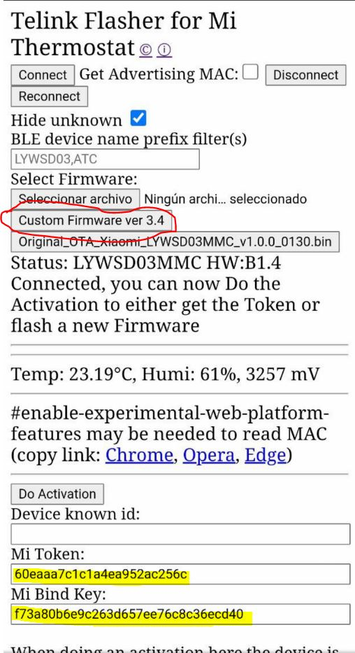

# Hardware

Dícese de todos los cacharricos que hacen funcionar la domótica, en esta sección hablaremos del hardware habitual que usamos en la domótica, desde enchufes inteligentes, arduinos e impresoras 3D.

## Sobre impresoras 3D

Buscas unos complementos para tus proyectos 3D, nada mejor que una impresora 3D

**¿Cómo se mandan los ficheros para imprimir a la impresora 3D?**

Coges tu tarjeta micro SD que te regalan con la impresora (con su cutre adaptador que regalan), vas a tu ordenador de cabecera y guardas tu ficherito de lo que vayas a imprimir, vuelves a tu impresora 3D, metes tarjetita, y con el menú de la impresora (usando su ruletilla), empiezas a imprimir.

* Puedes pausar la impresión, y retomarla después
* Puedes parar la impresión (cancelarla)
* Puedes pausar la impresión, apagar la impresora, y retomarla otro día
* Si se va la luz, puedes retomar la impresión donde se quedó

También pues usar Raspberri Pi 3 (a partitr de), le pones una webcam soportada, instalas octopi, y puedes:

* Verla a distancia
* Mandarle el fichero a traves de su interfaz web, todo puedes hacerlo a distancia, podrás monitorizar, temperaturas y progreso de la impresión
* Puedes pausar y reanudar la impresión
* Puedes cancelar la impresión
* Si de va la luz, o tu PI se bloquea, NO PUEDES REANUDAR LA IMPRESIÓN donde se quedó (esa es la principal desventaja)
* Octopi se comunica con la impresora a través de un puerto serie USB
* Si imprimes desde la impresora (opción 1), no puedes ver el progreso de la impresión, pero seguirás viéndola.
* Puedes grabar timelapse, manejar los motores, temperaturas, etc...
* Se integra perfectamentecon Home Assistant, eso sí, recuerda que si la apagas a distancia, acuérdate de apagar la raspberry pi antes, se puede hacer desde el interfaz web o través de SSH, todo automatizable

**Vale, ¿y que puedo imprimir?**

Lo que quieras, hay un repositorio de piezas ya creadas, seguro que alguién ya ha hecho lo que buscas, o se adapta bastante a tu proyecto, el sito es: <a href="https://www.thingiverse.com/" target="_blank">Thingverse</a>

Me descargo lo que me gusta y a imprimir, no tan rápido amigo 

**¿Puedo diseñarme mis propias piezas?**

Pues claro, y si quieres puedes modificarlas, modificas los ficheros STL, con Blender, auotcad, etc.. requiere de algún conocimiento, Blender es muy potente

**Y me he descargado la pieza que me gusto, ¿la imprimo, no?**

No tan rápido, antes de imprimirla, hay que convertirla a fichero GCODE, digamos que usas un programa (CURA) para dicidir la pieza en cortes que puedra procesar la impresora.
En ese fichero defines los parámetros, de velocidad de impresión, separación entre capas, temperatura de tu boquillla, si necesita tu pieza soporte, el relleno, la combinación de esos factores, hace que una pieza la puedas imprimir en poco tiempo,o tardes hasta días, un programa a estudiar

**¿Que materiales se usan para imprimir?**

Normalmente el más común es filamento PLA, o PETG, son rollos que suelen durar bastante, cuestan sobre unos 20€ y te da para muchas piezas, también puedes imprimir con plástico ABS, algo más complejo, y plástico flexible

**¿Es ruidosas la impresora?**

No mucho, está sobre unos 40 Db, modelo Ender 3 PRO, aunque estar al lado de ella, puede ser algo molesto (por ejemplo si la pones en tu oficina)

**¿Que modelo para empezar?**

Si vas ajustado de presupuesto una Ender 3, por poco más una Ender 3 pro, tienes algunas mejoras que hacen un impresora más completa

**¿Y se puede mejorar?**

Todo lo que tu quieras, hay un montón de piezas que se pueden cambiar para mejorarla y conseguir más calidad en tus trabajos, pero para el día a día y en tus proyectos domótico, a mi humilde entender, con lo que hay de serie es suficiente.

**¿Es dificil de calibrar?**

Es muy sencillo, solo hay que mover 4 ruletillas, para ajustar la boquilla a la base (la cama)

**¿Que es un cama?**

Es la parte donde apoyan las piezas, normalmente se calienta, para conseguir que las piezas se peguen mejor.

**¿Con que cama viene la Ender 3 Pro?**

Una cama magnética, esto es una especia de hoja magnetica, que se quita y se pone para ayudar a quitar las piezas una vez impresas

**¿Necesita mucho mantenimiento?**

No mucho, pero cada mes, un engrasado y limpieza le viene de perlas

**¿Gasta mucha luz?**

No mucho, no es un brasero, pero tampoco una luz led

## Pin Out ESP32

Para saber la función de todos los pines de tu ESP32, sigue esta fantástica URL:

!!! info "<a href="https://randomnerdtutorials.com/esp32-pinout-reference-gpios/" target="_blank">PinOut ESP32</a>"

## Como conectar un tira LED a un ESP32

Por si quieres conectar una tira led aun ESP32, este es el esquema:

<figure markdown> 
  
</figure>

## Cambiar Firmware termómetro Xiaomi Mijia LYWSD03MMC

Te gustaría podes controlar los termometros pequeñitos de Xioami desde Home Assistant, puedes hacerlo sin tener que soldar:

<figure markdown> 
  { width="300" }
</figure>

Se recomiendo el uso de un teléfono Android, para ello desde el movil navega a:

[https://pvvx.github.io/ATC_MiThermometer/TelinkMiFlasher.html](https://pvvx.github.io/ATC_MiThermometer/TelinkMiFlasher.html)

Al conectarte te aparecerá una pantalla así, pulsa en **Connect**

<figure markdown> 
  { width="300" }
</figure>

Cuando le des te aparecerá una lista de dispostivos Bluetooth, como recomendación, acercaté todo lo que puedas al termométro, el dispositivo que tenga más cobertura es nuestro termómetro, lo seleccionas y lo emparejas.

<figure markdown> 
  { width="300" }
</figure>

Tras un rato, debera de conectar, podrás verlo porque te aparece una pantalla con la temperatura y la humedad que tiene tu termómetro:

<figure markdown> 
  { width="300" }
</figure>

Ahora pulsado el botón **Do Activation** y tras un rato, te aparecerá una pantalla así, donde aparece el Token del termómetro:

<figure markdown> 
  { width="300" }
</figure>

Ahora le damos a **Start Flashing**, y una vez que llegue al 100% ya lo tendremos flasheado y listo para añadir a nuestro Home Assistat o a nuestro ESP32.
