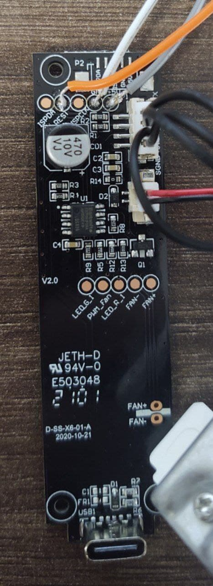
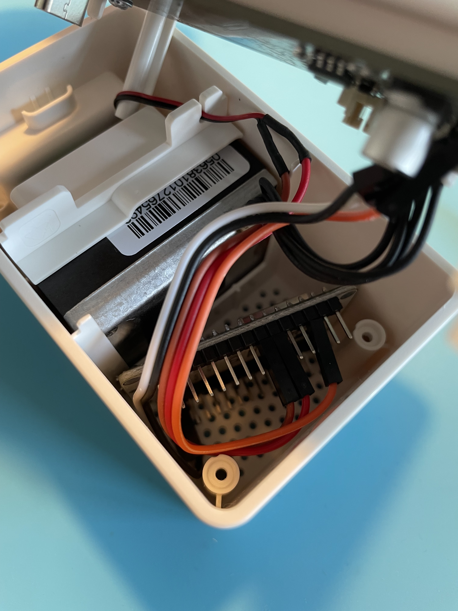

# Sensor de Calidad el Aire IKEA

¿Te gustaría saber como es de limpio tu ambiente?, ¿has oido hablar de las partículas PM2.5?, si quieres tener tu casa limpia de contaminantes, este es tu sensor, por muy poco precio y un poco de trabajo podrás tenerlo.

## ¿Que necesito?

Se necesitan varios elementos de hardware y algo de software:

* Sensor de calidad del Aire Vindriktning del IKEA <a href="https://www.ikea.com/es/es/p/vindriktning-sensor-calidad-aire-70498242/" target="_blank">IKEA</a> **15€**
* Un ESP32, a ser posible un <a href="https://es.aliexpress.com/item/32816149164.html" target="_blank">Wemos</a> ya que cuando más pequeño mejor, se puede poner un ESP32 normal pero entra un poco justo **5€**.
* Cables Dupont

## Pasos a seguir

Desmonta tu sensor, tiene cuatro tornillos de estrellas detrás. Saca la pequeña placa base que tiene y preparate para soldar.

<figure markdown> 
  { width="300" }
  <figcaption>Placa base</figcaption>
</figure>


<figure markdown> 
  { width="300" }
  <figcaption>Donde soldar</figcaption>
</figure>

El esquema de conexión es el siguiente:

<figure markdown> 
  
  <figcaption>Donde soldar</figcaption>
</figure>

Una vez soldado, tus cables deberían estar mas o menos así:

<figure markdown> 
  { width="300" }
  <figcaption>Cables soldados</figcaption>
</figure>

Y ahora mete tu ESP32 dentro de la cajita de plástico, ten cuidado y evita que los pines del ESP32 toquen la parte de metal que hay dentro.

<figure markdown> 
  { width="300" }
</figure>

Puedes añadir una antena WIFI a tu ESP32 si no te llega bien la señal:

<figure markdown> 
  { width="300" }
</figure>

Antes de cerrar tu ESP32 vamos a programarlo, para ello <a href="https://www.domoticafacil.xyz/integraciones/esphome/#crear-tu-primer-nodo-esp" target="_blank">creaté un nuevo nodo</a> en ESPHOME y añade el siguiente código:

```yaml
uart:
  rx_pin: D2
  baud_rate: 9600

sensor:
  - platform: pm1006
    pm_2_5:
      name: "IKEA Vindriktning PM2.5 sensor"
```

Genera tu fichero binario, <a href="https://www.domoticafacil.xyz/integraciones/esphome/#flashear-esp32" target="_blank">y graba tu firmware en tu ESP32</a>. Si todo va bien, podrás añadir tu sensor de calidad del aire a Home Assistant.


