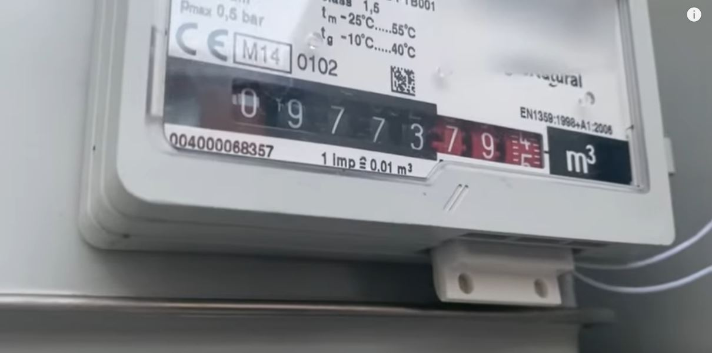

# Lee tu contador de Gas

¿Te gustaría saber el consumo de gas que tienes?, ¿estás harto de bajar a tu cuarto de contadores y mirar la lectura para mandarla a tu distribuidora?, eso se ha terminado, ya puedes leer tu contador de gas desde Home Assistant. Lo mejor de todo es que no es invasivo y las lecturas son bastante exactas.

## ¿Que necesito?

Necesita disponer de los siguientes materiales/requisitos

**Requisitos**

 * Zigbee instalado y funcionando.
 * Algo de maña soldando.

 **Materiales**

 * Soldador
 * Estaño
 * Sensor Zigbee de puertas, uno cualquiera de Xiaomi o <a href="https://es.aliexpress.com/item/1005003687981733.html?spm=a2g0o.productlist.0.0.583a32a2CASbwM&algo_pvid=d1341bfe-3e99-4a37-9aa3-b5aad0bd8e55&algo_exp_id=d1341bfe-3e99-4a37-9aa3-b5aad0bd8e55-0&pdp_ext_f=%7B%22sku_id%22%3A%2212000027108305524%22%7D&pdp_pi=-1%3B13.99%3B-1%3B-1%40salePrice%3BEUR%3Bsearch-mainSearch" target="_blank"> Aqara:</a> **13.9€**
 * Un detector de puertas/ventanas abiertas <a href=" https://es.aliexpress.com/item/457511345.html?spm=a2g0o.productlist.0.0.61a4453eay5QaO&algo_pvid=05d9c78b-0f40-4300-9899-4b1485e18733&algo_exp_id=05d9c78b-0f40-4300-9899-4b1485e18733-20&pdp_ext_f=%7B%22sku_id%22%3A%2212000020814320514%22%7D&pdp_pi=-1%3B1.0%3B-1%3B-1%40salePrice%3BEUR%3Bsearch-mainSearch" target="_blank"> Cableado</a> **1€**

## Empareja tu dispositivo

Antes de proceder a soldar es recomendable emparejar tu dispositivo con Home Assistant.

## Modificando el sensor Zigbee

 Abre tu sensor, puedes usar un destornillador de punta plana y abrir por la muesca que trae, a la que abras te aparecerá algo parecido a esto:

<figure markdown> 
  
  <figcaption>Sensor abierto</figcaption>
</figure>

Ahora tendrás que soldar los cables de tu sensor cableado aquí, da igual el orden, no te preocupes si se te despega el sensor original, ya que con este sensor lo vamos a puentear.

<figure markdown> 
  
  <figcaption>Puntos donde soldar</figcaption>
</figure>

Una vez soldado, te debe de quedar algo así:

<figure markdown> 
  
</figure>

Asegurate de que funciona, puedes usar el iman que viene con el sensor Aqara y prueba a acercarlo-alejarlo, si funciona en Home Assistant cambiará de estado.

## Instalando el sensor cableado en el contador

Dependiendo de el modelo del contador, tendrás que hacer o no modificiaciones tu sensor cableado, si tu contador es de la marca Gallius:

<figure markdown> 
  { width="300" }
</figure>

Tendrás que adaptar tu sensor para meterlo en el hueco que hay justo debajo, para ello con un cutter y teniendo mucho cuidado procede a ir quitando trozo de plastico poco a poco, hasta que no puedas más ya que el sensor que hay dentro nunca deberás cortarlo.

<figure markdown> 
  
  <figcaption>Sensor reducido artesanalmente</figcaption>
</figure>

Cómo norma general estos sensores vienen con cinta de doble cara, una vez que recortados ya puedes meterlos en el hueco que hay, ha de tocar al fondo del hueco.


<figure markdown> 
  
  <figcaption>Sensor colocado</figcaption>
</figure>

Si tu contador es de este modelo:


<figure markdown> 
  
  <figcaption>Contador G4</figcaption>
</figure>

No necesitas hacer ninguna modificación, ya que le sensor entra perfectamente, quedará de esta manera:

<figure markdown> 
  
  <figcaption>Sensor colocado, captura tomada de: <a href="https://www.youtube.com/watch?v=1TM-968CpTo" target="_blank">Un loco y su tecnología</a></figcaption>
</figure>

Una vez instalado observa el sensor, tarda muy poco en cambiar de estado, dependiendo del sensor cambiará de abierto a cerrado o de cerrado a abierto:

<figure markdown> 
  
  <figcaption>Cada pulso es una vuelta de ruleta</figcaption>
</figure>

## Configurando nuestro sensor en Home Assistant

Deberás de crearte un ayudante de tipo contador con los siguientes parámetros:

* **Nombre:** Puedes ponerle el que quieras

* **Valor inicial:** Es muy interesante inicializar tu contador de pulsos al valor inicial de lo que marque tu contador, haz esto antes de añadir el sensor de gas a tu panel de energía. Por ejemplo yo tenía una lectura de gas de 10340382 y le puse el valor de 1034038.

**Contando los pasos de nuestro contador**

Ahora nos tendremos que crear una automatización para incrementar nuestro contador cuando el iman del contador pase por nuestro sensor, para ello nos crearemos la siguiente automatización:

```yaml
alias: Contador de Gas
description: Automatización que nos ayudará a contrar las veces que gira la ruleta
trigger:
  - platform: state
    entity_id: binary_sensor.mijia_pulsos_gas_casa_zigbee
    from: 'on'
    to: 'off'
condition: []
action:
  - service: counter.increment
    target:
      entity_id: counter.contador_de_pulsos_de_gas
mode: single
```

!!! tip "A tener en cuenta" 
    Dependiendo del sensor tendrás que poner *from on to off o from off to on*

**Calculando los metros cúbicos**

Para que en sensor lo reconozco el panel de energía debes de añadir esto en tu configuration.yaml (esta es la nueva forma de añadir los templates)

```yaml
template:
    - sensor:
       - name: "Contador de Gas"
         unit_of_measurement: "m³"
         #state_class: measurement
         device_class: gas
         state: "{{states('counter.contador_de_pulsos_de_gas')| float * 0.01 }}"
         state_class: total_increasing
```

Guarda y renicia, ahora mira en el panel de energía, ya debe aparecer disponibles, tras un tiempo podrás ver tus consumos:

<figure markdown> 
  
</figure>

**Saber el consumo del día**

Si quieres saber el consumo de gas en el día, y mostrarlo en otro panel que no sea el de energía, te puedes crear un utility meter:

```yaml
consumo_gas_hoy:
    source: sensor.contador_de_gas
    cycle: daily
```
Y mostar un panel tal que así:

<figure markdown> 
  
</figure>

Para más información puedes <a href="https://www.youtube.com/watch?v=1TM-968CpTo" target="_blank">seguir este vídeo</a> en el canal de un loco y su tecnología.


 

