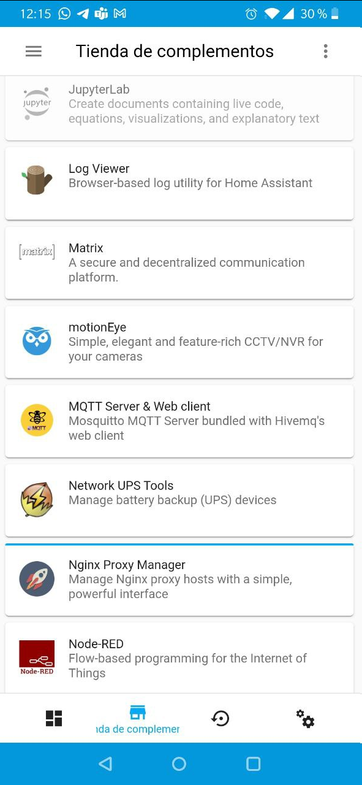
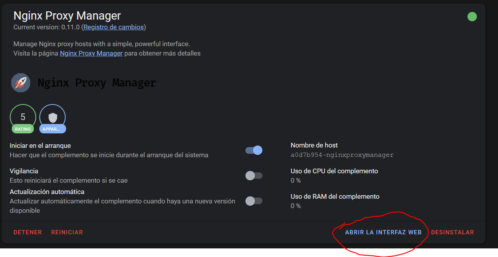
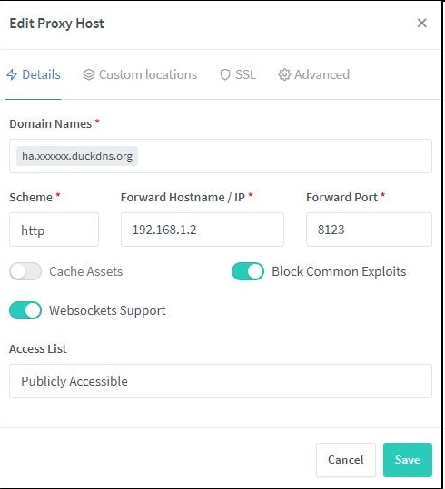
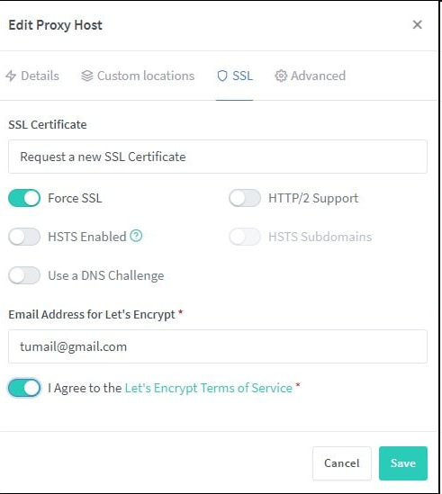
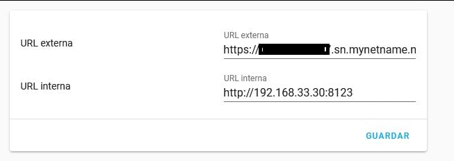

# Acceder a Home Assistant

Ya tienes instalado Home Assistant, puedes acceder a el en local, pero te gustaría estar fuera de tu casa y ver como va todo, encender la calefacción, el aire acondicionado, todo desde la comodidad de tu móvil, ¿es esto posible?, ¿necesito pagar algo?, aquí todas las respuestas.

## Acceder usando NabuCasa 

¿Que es <a href="https://www.nabucasa.com/" target="_blank">Nabu Casa?</a>, es la nube que provee la organización de Home Assistant para que puedas acceder directamente desde fuera de tu casa, sin preocupaciones y apenas esfuerzos, tiene un coste de unos 5€ mensuales, que van dedicados a pagar a todos los desarrolladores que trabajan en mejorar todo el universo de Home Assistant. Si te lo puedes permitir, ¿que mejor forma de aportar al proyecto?.

Puedes probar un mes gratuito y evaluar si te interesa, además permite la integración de los altavoces de Alexa y Google de una forma muy sencilla. También se pueden integrar sin necesidad de la nube, en el caso de Alexa lleva trabajo adicional.

Si tu red está bajo CG-NAT, esta es la única opción para acceder a tu instancia de Home Assistant desde fuera.

## Usando Nginx Proxy Manager

Sin duda es la opción preferida por el grupo, permite redirigir varios servicios. Partimos de que este tutorial funciona con cualquier router que te permita abrir los puertos 80 y 443.

??? tip "Requisitos"

    * Un dominio propio, puedes crerarlo gratuitamente con <a href="https://jungle-team.com/crear-dominio-con-duckdns/" target="_blank">** DuckDns ** </a>, o usar el de tu propio <a href="/red/mikrotik#usar-dominio-de-mikrotik-para-acceder-a-home-assistant-ssl" target="_blank">** router ** </a> si te lo proporciona. (Mikrotik)

Instalar y configurar el addon Nginx Proxy Manager siguiendo la pestaña documentación del addon. Para que este addon funcione debes tener instalado el addon mariaDB.

<figure markdown> 
  { width="300" }
</figure>

Debes tener abiertos los puestos 80 y 443 de to router, redirecciona el puerto externo 443 tcp al puerto 443 tcp interno de la raspberry y lo mismo para el 80. Si tienes un Mirotik, puedes seguir esta <a href="/red/mikrotik/#abrir-puertos" target="_blank">guía</a>


Entra en el addon y abre la interfaz web, el usuario es: **admin@example.com** y la contraseña: **changeme**, en cuanto te sea posible, cámbiala.

<figure markdown> 
  
</figure>

Una vez dentro de Nginx, vete a **Proxy Host :material-arrow-right:  Add Host** 

<figure markdown> 
  
</figure>

En Domain Names, pones el nombre de tu dominio, que puedes ser el que tengas de mikrotik tipo serial.sn.mynetname.net, uno de duckdns, incluso puedes tener uno contratado (crear en tu proveedor una Zona DNS Tipo A y poner tu ip pública) y redirigirlo a donde quieras.

Create un certificado SSL, importante creaté uno nuevo por cada dominio, ojo no lo reutilices, usa una cuenta de correo real:

<figure markdown> 
  
</figure>

Ahora solo falta cambiar en Homeassistant actualizar, en la configuracion general, las URLs interna y externa:

<figure markdown> 
  
</figure>

** Si tienes problemas para acceder**

Si tienes para acceder a tu servidor usando estos pasos, revisa el log, y si encuentras algo parecido a esto:

```
Logger: homeassistant.components.http.forwarded 
Source: components/http/forwarded.py:91 
Integration: HTTP (documentation, issues) 
First occurred: 18:54:11 (1 occurrences) 
Last logged: 18:54:11 
A request from a reverse proxy was received from 172.30.33.2, but your HTTP integration is not set-up for reverse proxies
```

Añade en el **config.yaml**, las siguientes líneas:

```yaml
http:
  use_x_forwarded_for: true
  trusted_proxies: La IP que te aparece en el log
```
!!! warning "Una vez terminada la configuración debes cerrar el puerto 80"

Ten en cuenta que el certificado digital se renueva automáticamente cada 3 meses, es importante que cuando esté a punto de caducar abras el puerto 80, sino lo abres, tu certificado no se renovará, para saber cuando le queda a tu certificado puedes usar la integracion **Cert Expiry**:

!!! note "Documentación <a href="https://www.home-assistant.io/integrations/cert_expiry/" target="_blank">Cert Expiry </a>"

