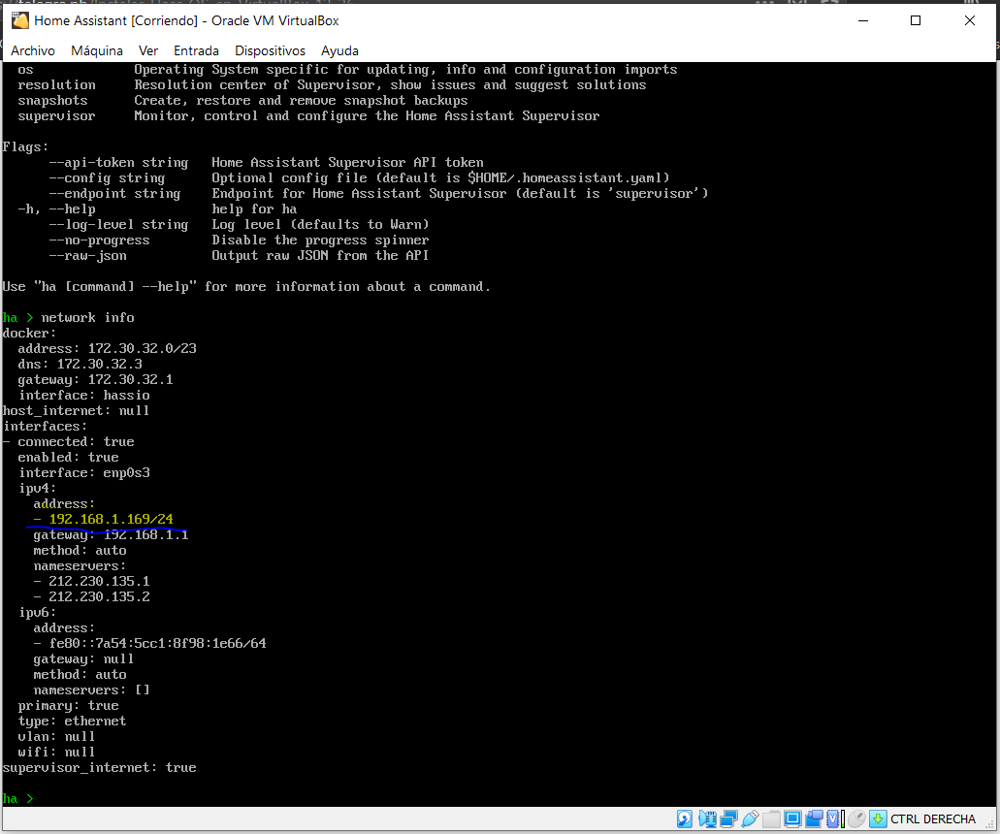

Home Assistant es software libre, y esto permite que este disponible en multitud de plataformas, se puede instalar en windows, linux, raspberry, en un NUC, en casi cualquier sito, ¿te atreves a instalarlo?.

## Instalación en Raspberry Pi 3 y 4

Si dispones de una Raspberry Pi 3 o 4 puedes seguir este tutorial de nuestro compañero Sergio donde nos da las claves para que nuestro proceso tenga éxito. Este método instala el sistema operativo de Home Assistant. 

!!! info "<a href="https://domoticafacil.home.blog/2019/05/25/como-instalar-hass-io/" target="_blank">** Proceso de instalación **</a>"


Desde el canal te recomendamos que lo hagas sobre una Raspberry Pi 4 con almenos 4 GB de ram, si tienes una Raspberry Pi 3 también puedes hacerlo, aunque quizás se queda un poco justa.

## Instalación de Home Assistant sobre Docker en Raspberry

Existe otro método de instalación en Home Assistant, consiste en instalar Docker sobre el sistema operativa Raspbian, y sobre este instalar un contenedor con Home Assistant, esto te permite poder utilizar la Raspberry como una ordenador normal, con su escritorio, utilidades y  además usar Home Assistant.

Para este método de instalación os recomendamos tener disponer al menos de una Raspberry Pi 4 con al menos 4 GB de ram

!!! note "Nota"
    Ojo, este tipo de instalación no está soportada por la comunidad de Home Assistant, ¿esto que significa?

    * Te aparecerá un aviso en tu servidor de que este tipo de instalación no está soportada.
    * Si encuentras algún bug o error en la aplicación este no puede ser reportado a la comunidad de Home Assistant

En la práctica somos muchos miembros del grupo los que tenemos este tipo de instalación, y no estamos teniendo ningún tipo de problema, incluso no están atendiendo los bugs que reportamos.

!!! info "<a href="https://community.home-assistant.io/t/installing-home-assistant-supervised-on-raspberry-pi-os/201836" target="_blank">** Instalación de Docker en Raspbian**</a>"


### Instalar Raspbian

Para poder hacer este tipo de instalación debes de instalar Raspbian en tu raspberry, para ello deberás grabar en una tarjeta SD (recomendamos mínimo de 64 GB) la siguiente imagen:

!!! info "[** Imagen Raspberry OS con escritorio**](https://downloads.raspberrypi.org/raspios_armhf/images/raspios_armhf-2021-11-08/2021-10-30-raspios-bullseye-armhf.zip)"

## Instalación de Docker en Debian

Si dispones de una PC, un mini PC, puedes instalar el sistema operativo Debian Linux, instalar Docker y sobre este Home Assistant, esta instalación si está soportada oficialmente, sigue este tutorial:

!!! info "<a href="https://community.home-assistant.io/t/installing-home-assistant-supervised-on-debian-11/200253" target="_blank">** Proceso de instalación **</a>"

## Instalar en unidad USB

Si tienes una Raspberry Pi dedicada a Home Assistant te puede interesar usar una unidad USB para arrancar directamente desde ella, las tarjetas Micro SD terminan fallando, ya que nunca fueron diseñadas para estar escribiendo continuamente.

Lo primero de todo será hacer un copia de seguridad de Home Assistant, para ello usaremos el addon Home Assistant **Google Drive Backup.**

!!! info "<a href="https://www.youtube.com/watch?v=3d99S0-_iJk" target="_blank">** Instalar Google Drive en Home Assistant**</a>"

Nos descargamos en software de clonado de imágenes Balena Etcher, y la imagen completa de Home Assistant.

!!! info "<a href="https://www.balena.io/etcher/" target="_blank">** Balena Etcher**</a>"
!!! info "<a href="https://github.com/home-assistant/operating-system/releases/download/6.6/haos_rpi4-6.6.img.xz" target="_blank">** Instalar Imagen Home Assistant (32 Bits)**</a>"

Instalamos y abrimos Balena Etcher, seleccionamos la opción *Flash from file*, elegimos el destino donde queremos guardar el SO, en nuestro caso el SSD/USB (ese disco se va a formatear por lo que no importa ni el formato que tenga ni lo que tenga, ya que se borrará entero). Procedemos a flashear.

Una vez acabe ya teneos Hass Os en nuestro SSD/USB. Lo conectamos a un USB 3 de la Pi y esperamos que arranque. Desde un navegador de nuestro pc vamos a la siguiente dirección: [https://homeassistant.local:8123/](https://homeassistant.local:8123/). Si no te funciona, busca la ip de tu raspberry y sustitúyela por homeassistant.local. Si no podéis entrar,no seáis impacientes, esperad unos minutos, tomaros un café,cotillear por la ventana...

Os recomendamos cambiar la ip de Hassio, ya que por defecto la nueva instalación de pone en DHCP y os asignara una IP al azar. Eso se hace en la pestaña Supervisor:

<figure markdown> 
  
  <figcaption>Lugar donde configurar la IP</figcaption>
</figure>

Os creáis una nueva cuenta, e instaláis de nuevo el addon de Home Assistant. Ahora procedéis a recuperar vuestro backup:

!!! info "<a href="https://www.youtube.com/watch?v=25foRRq6jZ8&t=184s" target="_blank">** Vídeo de como recuperar backup**</a>"

## Instalar en Virtual Box

Este entorno es ideal por si quieres probar Home Assistant, lo primero que tendrás que hacer es descargar e instalar VirtualBox:

!!! info "Descarga"
    
    * <a href="https://download.virtualbox.org/virtualbox/6.1.16/VirtualBox-6.1.16-140961-Win.exe" target="_blank">Windows</a>
    * <a href="https://www.virtualbox.org/wiki/Linux_Downloads" target="_blank">Linux</a>
    * <a href="https://download.virtualbox.org/virtualbox/6.1.16/VirtualBox-6.1.16-140961-OSX.dmg" target="_blank">Mac</a>

Una vez descargado, tienes que instalar el complemento: VirtualBoxExtension Pack:

!!! info "<a href="https://download.virtualbox.org/virtualbox/6.1.16/Oracle_VM_VirtualBox_Extension_Pack-6.1.16.vbox-extpack" target="_blank">Descarga VirtualBoxExtension Pack</a>"

Ten en cuenta que has de tener la virtualización activada en el equipo, sino no te funcionará, para saber si la tienes activada en Windows 10, vete al Administrador de Tareas, rendimiento, y mira si tienes activada la virtualización:

<figure markdown> 
  
  <figcaption>Virtualizacion activada</figcaption>
</figure>

Ahora hay que descarganos una imagen de Home Assistant virtualizado:

!!! info "<a href="https://github.com/home-assistant/operating-system/releases/download/5.9/hassos_ova-5.9.ova" target="_blank">Descarga Home Assistant Virtualizado</a>"

Una vez descargada procedemos a importar la imagen descargada:

<figure markdown> 
  
  <figcaption></figcaption>
</figure>

Iniciamos nuestra nueva máquina virtual recien importada:

<figure markdown> 
  
  <figcaption></figcaption>
</figure>

??? tip "Si al inicar la máquina os da error"
    Si aparece el siguiente error:

    <figure markdown> 
      
    <figcaption></figcaption>
    </figure>
    
    Vas a Configuración Red, y habilitáis y deshabilitáis el adaptador de red:

    <figure markdown> 
      
    <figcaption></figcaption>
    </figure>

Si todo va bien, os deberá de arrancar la máquina:

    <figure markdown> 
      
    <figcaption></figcaption>
    </figure>

A continuación ponéis <code>root</code>, para saber que dirección IP tiene la máquina virtual: <code>network info</code>

<figure markdown> 
  
  <figcaption></figcaption>
</figure>

La dirección que os salga, es la que tenéis que poner en vuestro navegador, en mi caso tendría que poner **http://192.168.1.169:8123**. Ser pacientes, porque tarda un ratillo.

## Bloquear las actualizaciones en Docker

Alguna vez, se ha reportado algún error de tal manera que cuando Docker se actualiza, este no es compatible con Home Assistant, por lo que tenemos que esperar a que Docker saque una actualización, si actualizas tu sistema Linux habitualmente y no quieres actualizar Docker hasta estar seguro de que no se produce ningún problema de compatibilidad puedes hacer que Docker no se actualize.

**Para bloquear la actualización:**

```shell
  sudo apt-mark hold docker-ce sudo apt-mark hold docker-cli-ce
```

**Para desbloquear la actualización:**

```shell
sudo apt-mark hold docker-ce sudo apt-mark hold docker-cli-ce
```

Si has tenido problemas con la versión Docker 20.10.4, ejecuta los siguientes comandos:

```shell
sudo nano /usr/sbin/hassio-supervisor
```

Comentamos la última línea con un # y añadimos la siguiente línea:

```shell
runSupervisor
```

## Recopilación de todas las imágenes de Home Assistant

Si buscas alguna imagen en particular, para instalar Home Assistant en tu ordenador, mini-ordenador, nuc, Synology, es la siguiente:

!!! info "<a href="https://github.com/home-assistant/operating-system/releases" target="_blank">Todas las imágenes de Home Assistant</a>"


