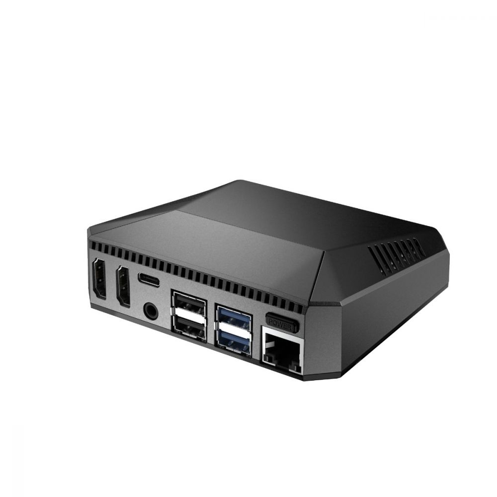
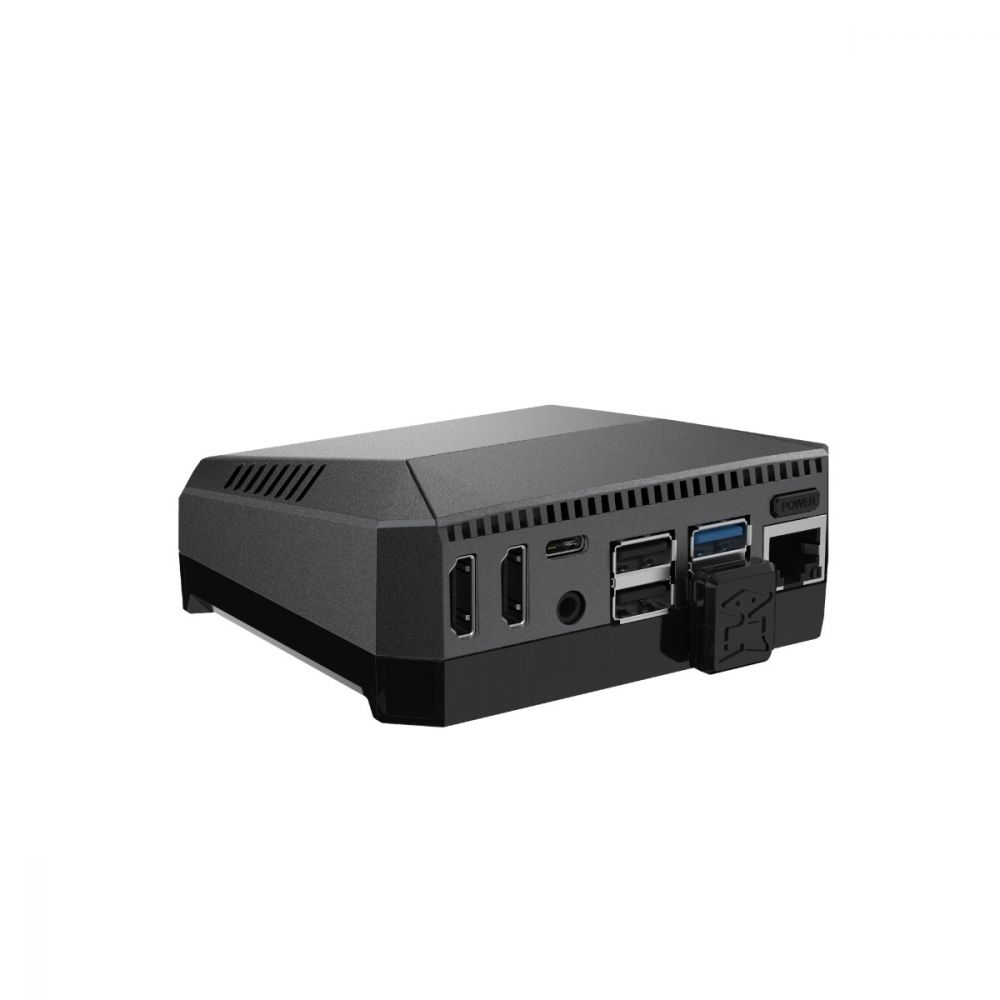
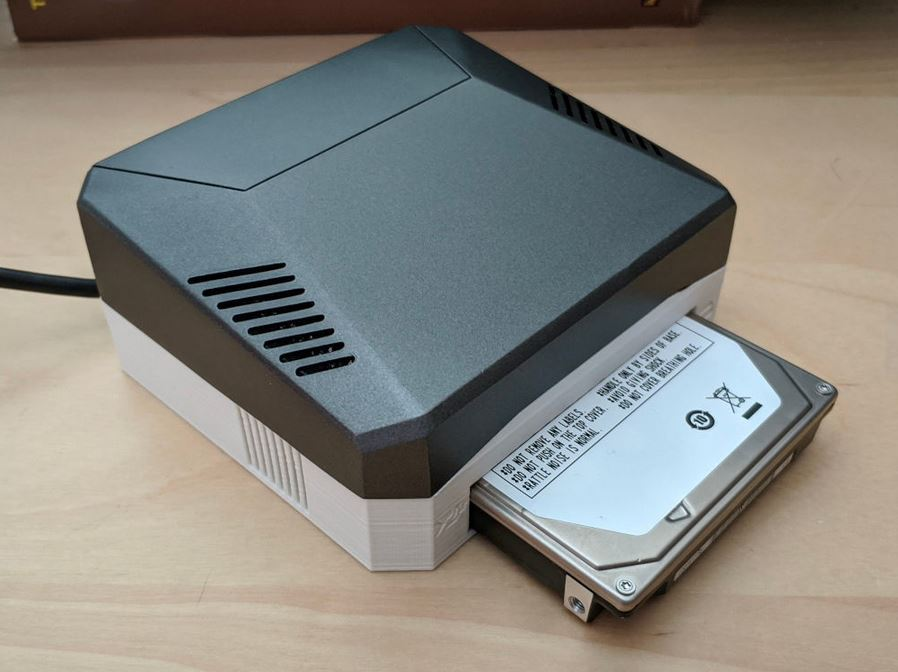
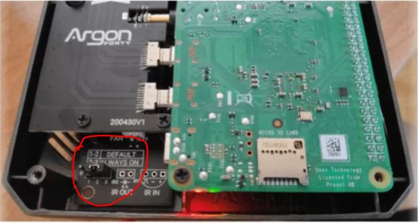

#Argon One

¿Buscas una carcasa para tu Raspberry Pi 4?, ¿odias los ruidos de ventilador?, Argon One es tu respuesta, es una caja realizada en aluminio que mantiene fresquita tu Raspberry, además dispone de ventilador que solo se enciende si es necesario, y además es configurable.

## Modelos

Actualmente hay dos modelos de carcasa para Raspberry Pi, por un lado tenemos el modelo Argon ONE V2  y el modelo Argon One M2. 

<figure markdown> 
  { width="300" }
  <figcaption>Argon One V2</figcaption>
</figure>

¿Qué diferencia hay entre estos dos modelos?, al modelo Argon One M2 le puedes meter un disco M2 (si esas memorias que son discos SSD), ¿merece la pena este modelo?, a nuestro juico vas a tener la misma velocidad con un disco SSD normal que con un disco M2, ya que al fin y al cabo ambos discos van a usar el interfaz USB 3.0. quizás como unica ventaja sería que el disco nunca está la vista, pero para eso hay soluciones muy válidas.

<figure markdown> 
  { width="300" }
  <figcaption>Argon One M2</figcaption>
</figure>

<figure markdown> 
  { width="300" }
  <figcaption>Una Argon One V2 con un disco duro Integrado</figcaption>
</figure>

## Instalando script en Raspbian (recomendado)

Si tienes Home Assistant sobre Raspbian, puedes usar el script oficial, y controlar al velocidad a la que se activa el ventilador, normalmente, los valores por defecto son ideales. Añade funcionalidades al botón de apagado de la Argon One.

Ejecuta la siguiente instrucción en la consola:

```
curl https://download.argon40.com/argon1.sh | bash 
```
Los valores configurados por defecto son estos:

| Si la CPU alcanza la temperatura de | Acción                                    | 
| :-----------------------------------| :-----------------------------------------|
| 55 ºC                               | El ventilador de pone al 10% de velocidad |
| 60 ºC                               | El ventilador de pone al 55% de velocidad |
| 65 ºC                               | El ventilador de pone al 100% de velocidad |

Una vez instalado, si quieres modificar las temperaturas a las que el ventilador se activa, ejecuta esta instrucción:

```
argonone-config
```

## Instalando addon Home Assistant

Indispensable para poder controlar a que velocidad se activa el ventilador, este addon permite controlarlo, para instalarlo:

!!! info "Instalar  <a href="https://github.com/adamoutler/HassOSArgonOneAddon" target="_blank">addon </a>"

## Usos del botón de encendido

Esta maravillosa caja, dispone de un botón de encendido, dependiendo de como lo pulses hará una acción u otra (*deberás tener instalado el script*):

| Estado incial | Acción                      | Resultado |
| :---------- | :-----------------------------|:--------------|
| OFF         | Pulsación corta               | **Encendido** | 
| ON          | Pulsación larga > 3s          | **Apagado por software y corte de corriente** | 
| ON          | Pulsación corta < 3s          | **No hace nada** | 
| ON          | Doble pulsación               | **Reinicio (software)** |
| ON          | Pulsación larga (>5s)         | **Apgado a la fuerza** |  


## La PI no se enciende si sufro un corte de corriente

Si observas que tu Raspberry Pi no se enciende después de un corte de corriente (y recuperas la energía), la carcasa Argon One tiene un jumper que controla estas acciones:

* Si tienes el jumper en 1-2, si pierdes la corriente y la recuperas tu PI **NO** se encenderá.
* Si tienes el jumper en 2-3, si pierdes la corriente y la recuperar tu PI **SI** se encenderá.

<figure markdown> 
  
  <figcaption>El jumper en cuestión</figcaption>
</figure>

## Donde comprar

Actualmente se pude comprar en diferentes sitios, esto es un resumen de los precios y lugares donde se puede comprar. (Precios a 30/11/2021)

*Argon One*

* Amazón: <a href="https://www.amazon.es/dp/B07WP8WC3V/?coliid=I3SJXHXWQO6ZYY&colid=3GFWVN3PETC98&psc=1&ref_=lv_ov_lig_dp_it" target="_blank">33,93€</a>
* AliExpress: <a href="https://es.aliexpress.com/item/1005002329535927.html?spm=a2g0o.productlist.0.0.79f42a8clA8AVb&algo_pvid=7b81ed88-5651-4b2f-bf19-b46d9d5ac6e9&algo_exp_id=7b81ed88-5651-4b2f-bf19-b46d9d5ac6e9-0&pdp_ext_f=%7B%22sku_id%22%3A%2212000023277264725%22%7D" target="_blank">26,42€</a>


*Argon One M2*

* Amazón: <a href="https://www.amazon.es/dp/B092SHHZNC/?coliid=I1C80CVGU4U6HY&colid=3GFWVN3PETC98&psc=1&ref_=lv_ov_lig_dp_it" target="_blank">73,69€</a>

* Aliexpress: <a href="https://es.aliexpress.com/item/1005002485134906.html?spm=a2g0o.productlist.0.0.4da337e7PEsxl1&algo_pvid=755db837-1d6b-480e-899c-a44e14a9c6f8&algo_exp_id=755db837-1d6b-480e-899c-a44e14a9c6f8-0&pdp_ext_f=%7B%22sku_id%22%3A%2212000020825050956%22%7D" target="_blank">20,77€.</a> Solo venden la base de expansión, necesitas Argon One


