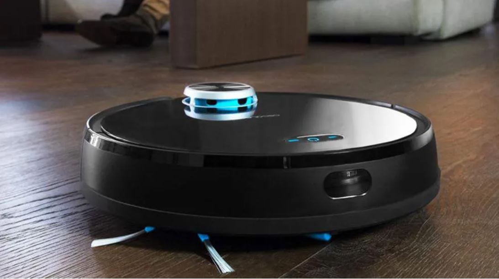
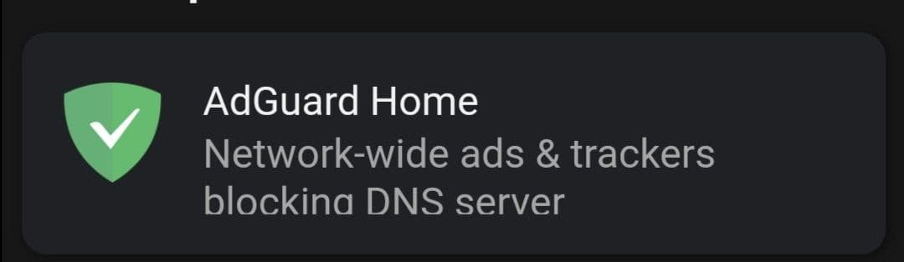
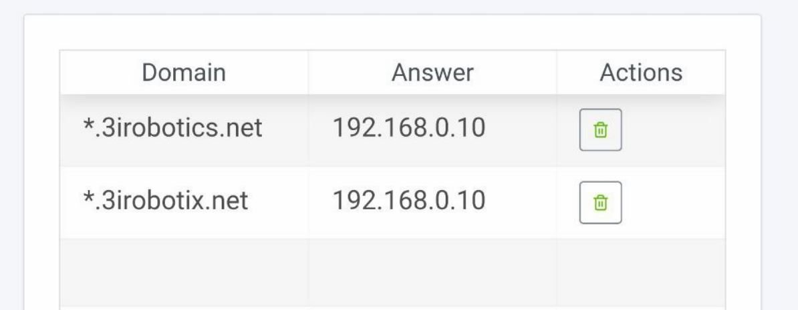
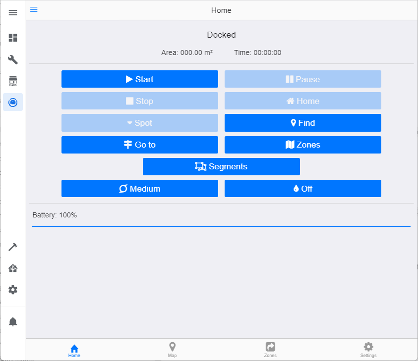
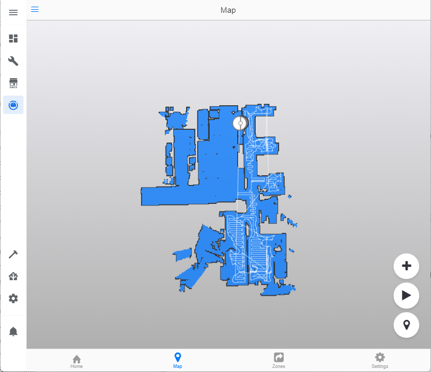
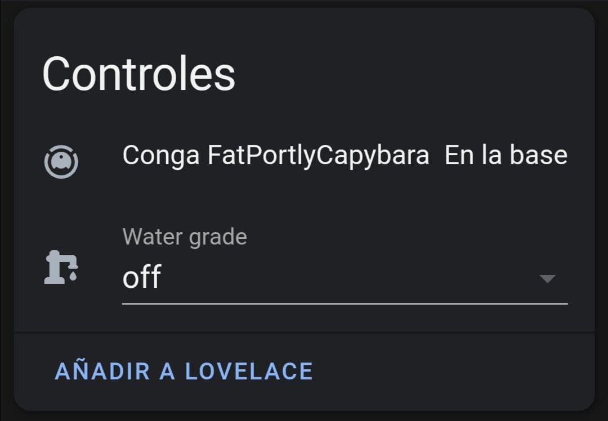

# Conga

El aspirador "barato" made in spain, pero que al fin y al cabo es un diseño totalmente chino, la competencia barata de la Roomba, actualmente no está soportado por Home Assistant, pero se puede integrar a través de <a href="https://github.com/txitxo0/congatudo-add-on" target="_blank">**Congatudo**</a>, todo ello gracias al trabajo de los chicos de <a href="https://freecon.ga/" target="_blank">**FreeConga.**</a>

<figure markdown> 
  
  <figcaption>Una conga sacando brillo</figcaption>
</figure>

## Modelos soportados

Actualmente estos son todos los modelos soportados:

* Todos los modelos 3X90
* 4090
* 5490

## Proceso de instalación

 Lo primero de todo es que deberás tener conectada tu Conga con la app oficial de Conga, además es recomendable tener un mapa ya realizado de tu casa con la aplicación.
 Si esto ya lo tienes hecho, vamos a instalar el Addon que permite manejar la Conga a nuestro antojo.

**Instalando Congatudo**

Añade el siguiente repositorio desde aquí:

Ve al menú **Supervisor :material-arrow-right: Tienda de Complementos** y busca el addon Congatudo:

<figure markdown> 
  { width="300" }
</figure>

Haz click en instalar, una vez instalado, inicia el addon con Start.

**Instalado AddGuard**

Si no tienes este maravilloso addon,instala el addon addGuard, para ello ve al menú **Supervisor :material-arrow-right: Tienda de Complementos** y busca el addon AddGuard y procedes a instalarlo.

<figure markdown> 
  { width="300" }
</figure>

Para que el addon de AdGuard funcione deberás cambiar las dns de tu router, para ello deberás entrar en la configuración de tu router y cambiar las dns, cómo dns primaria pondrás la dirección ip donde tengas instalado Home Assistant, y como secundaria, te puede valer las de tu operadora o las Google.

Ahora vamos crear unas reglas de filtrado, para que toda petición que haga la Conga a sus servidores (que están en china), la haga directamente al addon de Congatudo, para ello selecciona la opción **Filters :material-arrow-right: DNS Rewrites** selecciona la opción DNS Rewrite y añades las siguientes entradas:

Entrada 1

* **Domain:** *.3irobotics.net
* **IP:** Tu dirección IP local donde tienes instalado Home Assistant

Entrada 2

* **Domain:** *.3iroboticx.net
* **IP:** Tu dirección IP local donde tienes instalado Home Assistant

Entrada 3:

* **Domain:** cecotec.das.3iroboticx.net
* **IP:** Tu dirección IP local donde tienes instalado Home Assistant

Entrada 4:

* **Domain:** cecotec.ota.3iroboticx.net
* **IP:** Tu dirección IP local donde tienes instalado Home Assistant

Te debería de quedar algo así:

<figure markdown> 
  
</figure>

**Hacer que nuestra Conga se conecta con Congatudo**

Una vez realizado estos pasos, ya solo tienes que apagar la Conga y volverla a encender, si todo ha ido bien podrás entrar en la interfaz de Congatudo y ver a tu aspiradora:

<figure markdown> 
  
   <figcaption>Menú principal</figcaption>
</figure>

<figure markdown> 
  
   <figcaption>Mapa</figcaption>
</figure>

Tu conga aparecerá con un nombre similar a este en dispositivos:

<figure markdown> 
  { width="300" }
</figure>

**Servicios que soporta**

Con esta integración los servicios que soporta son:

* **Locate**: Localiza a la Conga en el mapa.
* **Pause**: Para a la Conga.
* **Return to base**: Lleva a la Conga a la base.
* **send_command**: Manda un comando a la Conga.
* **start**: Manda la Conga a limpiar.
* **start_pause**: Para a la Conga o la inicia dependiendo del estado anterior.

