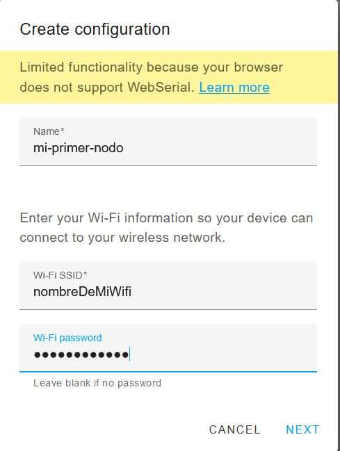

# ESPHome

ESPHome es un sistema para controlar todos los ESP2866/ESP32 de una manera simple y muy potene usando archivos de configuración muy simples, además se comunican de un forma muy fácil y sencilla con Home Assistant.

## Instalar Addon ESPHome en Home Assistant

Para ello ve al menú de **Supervisor :material-arrow-right: Tienda de Complementos** y Busca Esp Home, haces click y le das a instalar.
<figure markdown> 
  
</figure>
Una vez instalado te aparecerá en el menú lateral.

!!! info "Si quieres saber un poco <a href="https://www.youtube.com/watch?v=h7EHREUWTH8" target="_blank">más </a>"


## Hardware recomendado

Cualquier ESP32 o Wemos es suficiente, lo puedes adquirir por pocos euros en Aliexpress, hay diferentes modelos, con conexión a una antena Wifi, con una cámara (llamado ESPCAM), etc.

!!! info "Si quieres saber un poco <a href="https://descubrearduino.com/esp32-modulo-esp32-wroom-gpio-pinout/" target="_blank">más </a>"

## Flashear ESP32

Afortunadamente los ESP32 traen su propio puerto para poder programalos, tan solo necesitas un cable micro usb, el programa <a href="https://github.com/esphome/esphome-flasher/releases" target="_blank"> **ESPHome Flasher** </a>, y el archivo binario, que lo generarás con ESPHome. 

!!! info "Mira como se  <a href="https://youtu.be/NxDY_sgAh-g?t=161" target="_blank">flashea </a>"

## Crear tu primer nodo ESP

Ya tienes tu ESP32 en la mano, y te gustaría algo que hacer, pero tengo que programar en C++, quizás tengo que llamar a varias librerías, no, todo es mucho más fácil de lo que parece, todo a través de ESPHome. Para ello vamos a crear nuestro primer nodo:

Pulsamos sobre el símbolo +, que está justo abajo a la derecha:

<figure markdown> 
  { width="150" }
</figure>

Completamos los siguientes datos:

 * **Name:** Nombre que le darás a tu nodo para identificarlo rápidamente
 * **Wi-Fi SSD:** El nombre de tu wifi
 * **Wi-Fi password:** La contraseña de tu wifi

<figure markdown> 
  { width="250" }
</figure>

Seleccionas el modelo de tu ESP, normalmente es un ESP32, y automáticamente tu primer nodo estará creado:

<figure markdown> 
  { width="250" }
</figure>

Aparece con una linea roja por arriba indicando de que no esta disponible, evidentemente hasta que no lo flasehemos no estará disponible.

Para descargarte el firmware que luego grabarás en tu dispositivo deberás hacer click en los 3 puntitos de la derecha y seleccionar la opción de menú **Install :material-arrow-right:  Manual Download**

<figure markdown> 
  { width="250" }
</figure>

Ahora verás como automaticamente se empieza a compilar y generar el binario, dependiendo de la potencia de tu equipo puede tardar unos minutillos. Una vez que haya terminado, el ficharo binario se descargará, y así ya lo puedes <a href="http://localhost:8000/integraciones/espHome/#flashear-esp32" target="_blank"> **flashear** </a>


## Usar ESP32 como receptor Bluetooth

Tienes los famosos termométros de Xiaomi, si los cuadraditos pequeños, pero el Bluetooth de tu sistema domótico no los consigue leer, quizás está un poco lejos, pues puedes usar un ESP32.

<figure markdown> 
  { width="200" }
   <figcaption>Los famosos termómetros</figcaption>
</figure>

Aunque se pueden usar estos termómetros sin necesidad de cambiar el firmware os recomendamos encarecidamente de que los cambiéis.

!!! info "Cambiar  <a href="https://github.com/pvvx/ATC_MiThermometer" target="_blank">firmware </a>"

Una vez que tengamos los termométros con el firmware alternativo, podemos hacer que un ESP32 coja los valores de ese termométro y los transmita vía Wifi a nuestro servidor Home Assistant, ¿como lo hacemos?

Deberás tener [creado un nodo](/integraciones/espHome/#crear-tu-primer-nodo-esp) con un ESP32 en ESPHome. Necesitas saber las MAC Bluetooth de tu termometros, para saber la MAC de tu termométro:

  * Usar la aplicación de móvil Bluetooth Mac Address Finder (Android)
  * Usar la aplicación de Mi Home, buscar el termométro, emparejarlo y en características ver la MAC
  * Usar la integración de HACS  <a href="https://github.com/custom-components/ble_monitor" target="_blank">ble monitor </a>, y usar el asistente de esta integración para ver la MAC.

Añade las siguientes líneas a tu nodo de ESPHome:

```yaml
esp32_ble_tracker:

sensor:
  - platform: pvvx_mithermometer
    mac_address: "Aquí pones tu MAC, en el formato AA:0E:3F:56"
    temperature:
      name: "Temperatura estancia ejemplo"
    humidity:
      name: "Humedad estancia ejemplo"
    battery_level:
      name: "Nivel estancia ejemplo"
    battery_voltage:
      name: "Voltaje estancia ejemplo"
```
Guardas, compilas y si ha ido todo bien en un rato deberás de recibir lectura de todos los sensores que has dado de alta:

<figure markdown> 
  { width="250" }
</figure>

## Ampliar cobertura de un ESP32

Tienes problemas con tu ESP32, ¿se te desconecta habitualmente?, ¿no te llega el Wifi?, no te preocupes, sino te da miedo el soldador puedes conecetarle una antena a tu ESP y recuperar la cobertura.

Aunque tu ESP32 no tenga conector de antena,puedes cortar las pista de la antena Wifi y soldarle una antena:

<figure markdown> 
  { width="250" }
   <figcaption>Diagrama de donde hacer los cortes</figcaption>
</figure>


<figure markdown> 
  { width="250" }
   <figcaption>Corte en acción</figcaption>
</figure>

<figure markdown> 
  { width="250" }
   <figcaption>Adaptando un <a href="https://es.aliexpress.com/item/10000000835065.html?spm=a2g0s.9042311.0.0.130e63c0yhRio7" target="_blank">conector de antena </a>
   </figcaption>
</figure>

:fontawesome-brands-telegram:{ .telegram } <small> @jabato35</small> 

## Problemas con el log en ESPHome

¿Tines problemas con el log de tu nodo?, ¿accedes y recibes el mensaje de *no buffer space avlaible*?, pues tienes solución te contamos cómo.

<figure markdown> 
  { width="250" }
   <figcaption>Al mirar el log, recibes este mensaje</figcaption>
</figure>

Parece ser que es un problema del buffer de los interfaces de red que crea docker, que por alguna razón se queda sin espacio, prueba a ejecutar los siguientes comando en Raspbian:

```
sudo sysctl -w net.ipv4.igmp_max_memberships=50
sudo sysctl -w net.ipv4.igmp_max_msf=30
```

Comprueba si ya desaparece el mensaje, si sigue apareciendo prueba a subir un poco los valores. 
Estos cambios cuando reinicies los perderás, por lo que vamos a hacerlos fijos. Editamos el archivo sysctl.conf

```
sudo nano sysctl.conf
```

Y añades las siguientes líneas al final de archivo

```
sysctl -w net.ipv4.igmp_max_memberships=50
sysctl -w net.ipv4.igmp_max_msf=30
```

<figure markdown> 
  { width="250" }
   <figcaption>Archivo sysctl modificado</figcaption>
</figure>


