# Mikrotik

¿El router de tu operadora, se ha quedado corto?, ¿tienes problemas con el wifi de tu casa?, ¿y no puedes asignas mas IPs fijas?. Mikrotik es tu respuesta, los routers de la operadora son bastante básico, y para unos poco dispositivos es suficiente, pero que pasa cuando empiezas a tener bastantes dispositivos, tu red se vuelve inmanejable.

Podrás usar un Mikrotik, siempre y cuando puedas deshacerte del router de tu operadora, o puedas poner tu router en modo Bridge, de tal manera que toda la gestión de la red se la pasas al Mikrotik.

!!! warning "A tener en cuenta, la interfaz de usuario de Mikrotik no es nada amigable, y es de nivel avanzado, por lo que no te esperes menús sencillos y asistentes, requiere de paciencia y entender que estás haciendo, desde el grupo te echaremos una mano"

## ¿Que alternativas tengo?

Según las experiencias del grupo, hay varias alternativas:

### Usar un Mikrotik MikroTik Hex RB750Gr3  + AP Unifi

Con esta combinación, podrás el router Mikrotik gestionará tu red, y el [Punto de Acceso Ubitiqui](ubitiqui.md) gestionará toda tu red wifi.

<figure markdown> 
  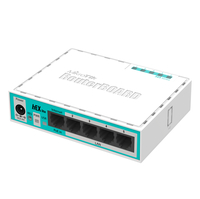
  <figcaption>Mikrotik Hex Lite</figcaption>
</figure>

Tiene un precio de <a href="https://www.amazon.es/gp/product/B01MSUMVUB/ref=ox_sc_act_title_1?smid=A1CSD37BFGDG5P&psc=1" target="_blank">** 50.87€ **</a>


### Usar un Mikrotik HAP AC2 ###

Con este Router podrás tener todo en uno, por un lado podrás gestionar tu red, y por otro lado la red Wifi, hay que tener en cuenta que el Wifi de Mikrotik no es de lo mejor del mercado en cuanto alcance, por lo que si en la última habitación de tu casa no te llega el Wifi, con el AP AC2 tampoco te va a llegar.

<figure markdown> 
  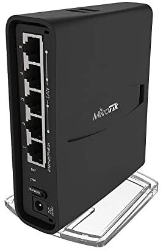{ width="150" }
  <figcaption>Mikrotik Hex Lite</figcaption>
</figure>

Tiene un precio de <a href="https://www.amazon.es/gp/product/B079SD8NVQ/ref=ox_sc_act_title_1?smid=A2RB1QEU2VOSLR&psc=1" target="_blank">** 62.33€ **</a>

### Usar tu propio Router y una red Zigbee ###

Si aun así no quieres cambiar el Router de tu operadora, puedes usar el mayor número de dispositivos con una red Wifi Zigbee alternativa. 

## Cómo tener tu red local en cualquier

¿Te gustaría poder llevarte tu red local a cuestas?, esto es posible, necesitas de hardware adicional (Hap Mini),para ello sigue el tutorial siguiente realizado por Pocoyo en el foro ADSLAyuda.


<figure markdown> 
  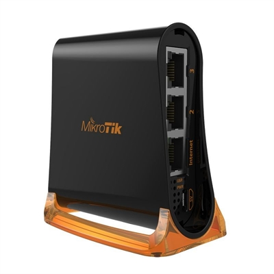{ width="200" }
  <figcaption>Hap Mini <a href="https://www.amazon.es/gp/product/B079SD8NVQ/ref=ox_sc_act_title_1?smid=A2RB1QEU2VOSLR&psc=1" target="_blank">21€</figcaption>
</figure>


!!! info "<a href="https://www.adslzone.net/foro/mikrotik.199/manual-mikrotik-tuneles-eoip-como-llevarte-tu-red-cuestas.520975/" target="_blank">** Tutorial **</a>"

## Conecta tu movil Android a tu router

¿Te has quedado sin internet en el router? tienes alternativas, puedes conectar tu móvil Android a tu Router Mikrotik y tener internet, estos son los pasos que has de seguir:

!!! info "<a href="https://blog.ligos.net/2017-08-16/Mikrotik-And-LTE-via-Android.html" target="_blank">** Conectar móvil Android a Mikrotik **</a>"

## Usar dominio de Mikrotik para acceder a Home Assistant (SSL)

Decir primero que el requisito de conocimientos para realizar esto es saber abrir puestos en Mikrotik para el caso del Hairpin NAT (o NAT Loopback). 

Desinstalar o parar el addon de DuckDNS. Ya no vamos a usarlo

Abrir el puerto 80 tcp externo y redireccionarlo al puerto 80 de nuestra host (rpi, nuc o lo que tengais). Este paso es necesario para poder securizar nuestro dominio con el addon Let's Encrypt. Suponiendo que vuestro host esté en la ip 192.168.2.10, el comando para abrir el puerto en Mikrotik sería el siguiente:

```
/ip firewall nat
add action=dst-nat chain=dstnat comment=Hassio-LetsEncrypt dst-address-list=public-ip dst-port=80 protocol=tcp to-addresses=192.168.2.10 to-ports=80
```
Instala el addon de Lets Encrypt desde la Add-on Store del menú Supervisor y configúrarlo de la siguiente manera:

```yaml
email: '!secret email_sergio'
domains:
 - '!secret home_domain'
 certfile: fullchain.pem
 keyfile: privkey.pem
 challenge: http
 dns: {}

```
*!secret home_domain será vuestro DDNS de Mikrotik sin https, que es del tipo blablabla.sn.mynetname.net*

El mail es necesario para poder generar los certificados (lo guarda let's encrypt en su base de datos), de tal manera que cuando  tu certificado esta a punto a finalizar te mandan correo, este addon automatiza la renovación de los certificados. Una vez configurado, ejecutarlo y mirar el log para ver que ha securizado correctamente.

Una vez securizado vuestro dominio, tan solo quedaría especificarlo en el addon de NGINX Proxy. Esta sería la configuracion del addon:

```yaml
domain: '!secret home_domain'
certfile: fullchain.pem
keyfile: privkey.pem
hsts: max-age=31536000; includeSubDomains
cloudflare: false
customize:
  active: false
  default: nginx_proxy_default*.conf
  servers: nginx_proxy/*.conf
```

*Donde secret_home_domain es vuestro DDNS de Mikrotik, es decir, el mismo que configurasteis en el addon de Lets Encrypt*

Una vez modificado, reiniciais el addon, y podríais acceder a vuestra instancia de HA securizada escribiendo: [nombredominio.sn.mynetname.net](nombredominio.sn.mynetname.net)

## Abrir puertos

Si quieres abrir puertos en este router es bastante sencillo, para ello lo primero de todo será habilitar el Hairpin Nat (Nat Loopback).

Esta opción nos valdrá para acceder a una máquina local (tipo un NAS o un webserver) usando un dominio público, cuando estemos dentro de nuestra propia red. En los routers comerciales al uso, normalmente esto ya viene implementado, y es algo por lo que no nos tenemos que preocupar. No obstante, en routers más avanzados, es una opción que hay que configurar a mano. La configuración básica, para una única máquina y un único puerto, la tenéis explicada en la wiki. No obstante, vamos a darle una vuelta de tuerca y a configurar esto para que el loopback funcione para todo el segmento de red y que, además, no tengamos que andar editando la regla de apartura de puertos del hairpin cada vez que necesitemos exponer un puerto nuevo. Para ello, vamos a hacer uso de una propiedad relativamente nueva en los routers mikrotik, llamada address-llists.

Primero, activamos el dominio ddns (primer truco):

```
/ip cloud set ddns-enabled=yes
```

Segundo, añadiremos nuestro dominio como una lista de direcciones, la cual vamos a llamar public-ip. Al hacerlo, el propio router resolverá nuestra IP pública, a la cual apunta el dominio.

```
/ip firewall address-list add address=[/ip cloud get dns-name] list=public-ip
```
Crearemos la siguiente regla de masquerade en el NAT, la cual colocaremos en la primera posición, antes que la regla por defecto (posición 0), obteniendo nuestra LAN dinámicamente. Suponemos que, si no se ha cambiado, nuestra LAN por defecto es la que se define en la primera entrada de "networks" en el servidor DHCP:

```
/ip firewall nat add action=masquerade chain=srcnat comment=hairpin-nat dst-address=[/ip dhcp-server network get 0 address] src-address=[/ip dhcp-server network get 0 address] place-before=0
```

Por último, creamos la apertura de puertos que queramos, pero con una pequeña modificación: ahora le diremos que el tráfico viene por nuestra IP pública. Al no tener una IP pública estática, no podremos usarla en el dst-address, pero como hemos creado la entrada en la lista de direcciones, podemos usar el dst-address-list como filtro. De esta manera no secuestramos todo el tráfico de nuestra red para ese puerto en cuestión, sino sólo el de entrada (el que tiene como destino la IP pública)
En este caso, abriremos el tráfico del puerto 443 externo (HTTPS) y lo redireccionaremos a la al puerto https de la consola de administración de nuestro equipo (supongo un servidor web situado en la IP 192.168.88.100 y con puerto de administración el 1234). Adaptar el ejemplo a vuestras necesidades:

```
/ip firewall nat
add action=dst-nat chain=dstnat comment=Web-Admin dst-address-list=public-ip \
dst-port=443 protocol=tcp to-addresses=192.168.88.100 to-ports=443
```
Para comprobar si los tienes activados, abre Winbox y ve a la opción de menú **IP :material-arrow-right: Firewall :material-arrow-right: NAT**, deberá aparecer el puerto abierto:


<figure markdown> 
  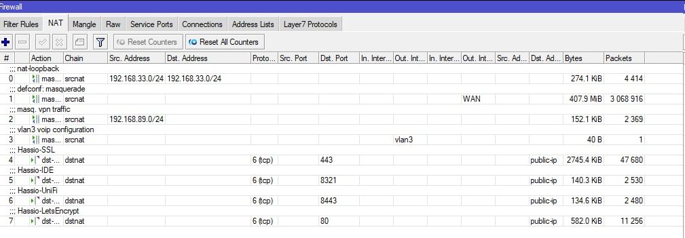
</figure>

Si haces doble click en la regla, con la ip que hayas definido, te deberá aparecer esto:

<figure markdown> 
  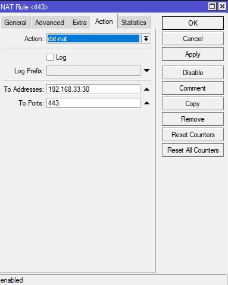
</figure>


**Fuente:** <a href="https://www.adslzone.net/foro/mikrotik.199/manual-mikrotik-tips-tricks.548449/" target="_blank"> Foro ADSLZONE </a>

## Crear tu primer backup en la nube

Para ello abre la consola de tu Mikrotik y ejecuta el siguiente comando, deberás de usara una contraseña:

```
/system backup cloud upload-file action=create-and-upload password=tu_contraseña
```

Visualizar el detalle del backup, incluida la clave de descarga del fichero (por si os queréis llevar la configuración a otro equipo)

```
/system backup cloud print
```

Descargar el backup en el propio equipo - Se descargará en Files y podréis restaurarlo con la contraseña de encriptado que pusisteis al crearlo [tu_contraseña]

```
/system backup cloud download-file action=download number=0
```

Descargarlo en otro equipo - Necesitaréis el secret-download-key que se proporciona por consola en el segundo paso, cuando mostramos la info del backup

```
/system backup cloud download-file action=download secret-download-key=XXXXXXXXX
```

Borrar el backup, para dejar el espacio libre y crear uno nuevo

```
/system backup cloud remove-file 0

```

**Fuente:** <a href="https://www.adslzone.net/foro/mikrotik.199/manual-mikrotik-tips-tricks.548449/" target="_blank"> Foro ADSLZONE - PocoYo </a>

## Crear y planificar backups de tu equipo

Una vez hecho y asumido el primer [backup en cloud](#crear-tu-primer-backup-en-la-nube), lo que vamos a hacer es muy simple, y se divide en dos pasos:

**Creación de script**

Vamos a crear un script que elimine el backup que ya está en los servidores, que cree uno nuevo y que lo suba a los servidores de MikroTik, de nuevo.

Para ello usa la interfaz Winbox y selecciona la opción de menú **System :material-arrow-right: Scripts**.

Añadís un script con el botón **+** y le ponéis el nombre que queráis, por ejemplo: **crear-backup-cloud**, con los siguientes permisos:

<figure markdown> 
  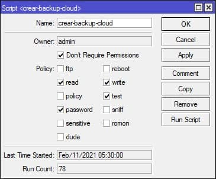
</figure>

Y abajo del todo, en el cuadro **source**, pegáis este código, modificando la password por una de vuestro gusto:

```
/log info message="cloud backup started"
/system backup cloud upload-file action=create-and-upload password=miSuperPassword replace=[/system backup cloud get 0 name]
/log info message="cloud backup finished"
```

Esto sería haciéndolo por la interfaz, yo lo hice así, pero bueno, si queréis que se cree con un solo comando de terminal, este sería el comando:

```
/system script
add comment="Actualiza un backup en la nube de Mikrotik" dont-require-permissions=yes name=crear-backup-cloud owner=admin policy=\
  read,write,test,password source="/log info message=\"cloud backup started\"\r\
    \n/system backup cloud upload-file action=create-and-upload password=miSuperPassword replace=[/system backup cloud get 0 name]\r\
    \n/log info message=\"cloud backup finished\"\r\
    \n"
```    
Pues ya está. Y ya sea a través de interfaz, o por comando de terminal, ya tenéis vuestro script que os actualiza un backup en cloud con vuesta configuración en el router.

**Planificar la ejecución del script recien creado**

Para este paso recomiendo la interfaz, osea, Winbox, ya que es muy intuitivo. En realidad los dos pasos los hice yo por interfaz, pero este más aun.

Seleccionáis menú **System :material-arrow-right: Scheduler**, creáis una nueva planificación con el botón **+**, y le ponéis un nombre, por ejemplo: *planificador-backup-cloud*

Día de inicio, el que queráis, que significa que lo hará a partir de ese día, antes de ese día no. Si por ejemplo ponéis un dia de la semana pasada ahí, o del año pasado, pues comenzará a hacerlo hoy mismo, luego la hora a la que queréis que lo haga y el intervalo de frecuencia que queréis que lo haga.

Con respecto a los permisos, serían los mismos que antes, pero podéis quitar el de la password, porque la planificación en si no lleva contraseña.

Ya faltaría lo más importante, en el campo "on event", especificar el nombre del script que creamos en el paso 1, quedando de esta forma:

<figure markdown> 
  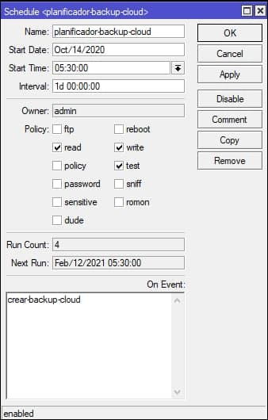
</figure>

Aplicais, guardáis, y ya tenéis planificado un backup recurrente de la configuración de vuestro MikroTik, en mi caso diario, y alojado en los servidores de MikroTik.

## Recuperar backup en la nube

Ha ocurrido lo que no esperabas, has tocado donde no debías, y tu Mikrotik ya no funciona como antés, menos mal que tienes creados los [backups automáticos en la nube](#crear-y-planificar-backups-de-tu-equipo), vamos a descargar nuestro backup y restaurar nuestro router.

Para ello ejecuta el siguiente comando en la terminal de Mikrotik:

```
/system backup cloud download-file action=download number=0
```

Tras un rato descargará, ahora si vas a la opción de menú **Files** veras tu fichero descargado, ahora solo te queda seleccionar el fichero, darle al botón **Restore**, meter la contraseña (si los tienes encriptados), y tu router se reiniciará con al configuración de tu backup.

<figure markdown> 
  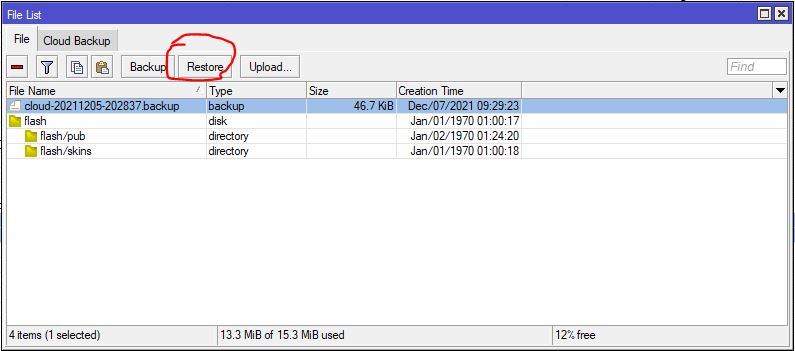
</figure>

## Firewall en Mikrotik

Por defecto los Router Mikrotik vienen con un firewall por defecto que evita que atacantes o personas externas puedan acceder a tu router, si por error las borras o las modificas, puede que recibas intentos de acceso, para ello puedes revisar el log, menú **log**.

<figure markdown> 
  { width="300" }
</figure>
<figcaption>Intentos de acceso a to Router</figcaption>

Si es así vete a la opción de menú **IP  :material-arrow-right: Firewall**, selecciona la pestaña **Filter Rules** y booras lo que tengas, y a continuación en la **Terminal**, ejecutas el siguiente comando:

```
/ip firewall nat add chain=srcnat out-interface-list=WAN ipsec-policy=out,none action=masquerade comment="defconf: masquerade"
                     /ip firewall {
                       filter add chain=input action=accept connection-state=established,related,untracked comment="defconf: accept established,relate>
                       filter add chain=input action=drop connection-state=invalid comment="defconf: drop invalid"
                       filter add chain=input action=accept protocol=icmp comment="defconf: accept ICMP"
                       filter add chain=input action=accept dst-address=127.0.0.1 comment="defconf: accept to local loopback (for CAPsMAN)"
                       filter add chain=input action=drop in-interface-list=!LAN comment="defconf: drop all not coming from LAN"
                       filter add chain=forward action=accept ipsec-policy=in,ipsec comment="defconf: accept in ipsec policy"
                       filter add chain=forward action=accept ipsec-policy=out,ipsec comment="defconf: accept out ipsec policy"
                       filter add chain=forward action=fasttrack-connection connection-state=established,related comment="defconf: fasttrack"
                       filter add chain=forward action=accept connection-state=established,related,untracked comment="defconf: accept established,rela>
                       filter add chain=forward action=drop connection-state=invalid comment="defconf: drop invalid"
                       filter add chain=forward action=drop connection-state=new connection-nat-state=!dstnat in-interface-list=WAN comment="defconf: >
                     }
```

Si ha ido todo bien, verás las reglas de tu Firewall con algo parecido a esto:

<figure markdown> 
  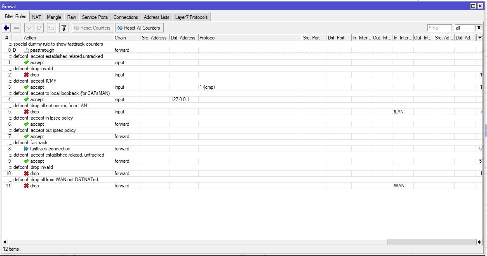
</figure>

## Wireguard en tu Mikrotik

¿Te gustaría tener tu propia red VPN?, ¿cuántas veces has deseado acceder a tu red local des fuera?, pero además con total seguridad y el máximo rendimiento, sin depender de ningún Hardware adicional, Mikrotik lo ha conseguido, ha implementado Wireguard en sus routers, ¿pero como lo hago?.

Lo primero de todo, deberás tener instala la versión Router OS 7 en tu Mikrotik.

### Instalando versión 7.0

Un requisito indispensable para tener Wireguard en tu Mikrotik es tener al menos la versión 7 de Router Os, ¿como lo instalo?, lo primero de todo y más importante, ten un backup a mano por si algo no va bien, si no sabes cómo, echa un vistazo a [esto](#crear-y-planificar-backups-de-tu-equipo).

Si tienes tu Mikrotik en una versión 6.x para actualizar, ve a la opción de menú **System :material-arrow-right: Packages** ,te aparecerá una ventana *Package List*, pulsas el botón **Check For Updates**, y en Channel seleccionas **upgrade**, deberás ver algo así:

<figure markdown> 
  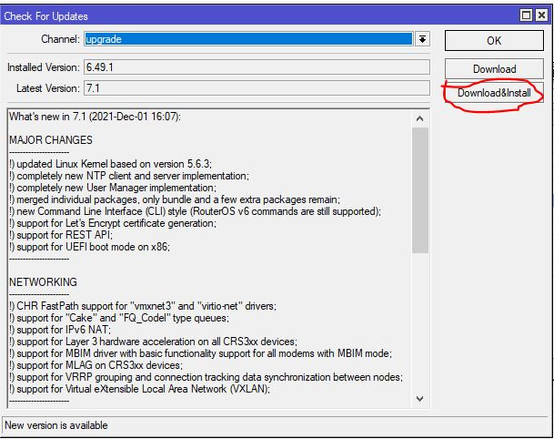
</figure>

Ahora dale sin miedo a **Download && Install**, tras dos o tres minutos tendrás ti Mikrotik ya actualizado.

### Actualizando el Firmware

Una vez instalado el Router OS 7 vamos a actualizar el firmware de tu dispositivo mikrotik, para ello vete a la opción de menú **System :material-arrow-right: RouterBoard**, y le das al botón **Upgrade**

<figure markdown> 
  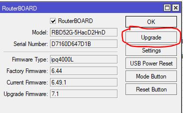
</figure>

Una vez actualizado el firmware reinicia to Router, para ello ve a la opción de menú **System :material-arrow-right: Reboot** ahora si miramos nuestra versión de firmware, este deberá estar actualizado:

<figure markdown> 
  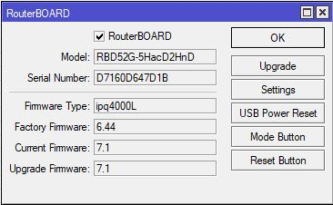
</figure>

:fontawesome-brands-telegram:{ .telegram } <small> @sermayoral</small> 

### Creando servidor VPN

Bueno el concepto de esta VPN es sencillo. La seguridad la garantiza creando un par de claves en ambos lados del tunel, en el cliente, y en el servidor, y con estas claves es capaz de cifrar y descifrar la información.

Lo primero que tenemos que hacer es crear la interfaz de wireguard en el router. Para ello se mete este comando en la terminal:

```
/interface/wireguard/add name=wireguard listen-port=51820
```
También se puede hacer por interfaz gráfica. Menú lateral **Wireguard** Pestaña **Wireguard** y pulsamos el **+** para añadir la interfaz, con los datos que aparecen en el comando.

<figure markdown> 
  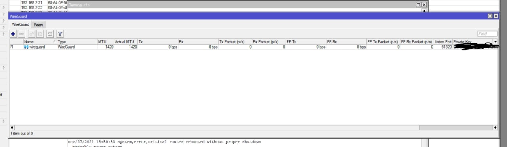
</figure>
<figcaption>Se crea el interfaz Wireguard</figcaption>

Con esto tendremos creada nuestra interfaz de Wireguard, se han generado un par de claves, una privada (no la compartas con nadie) y otra pública, es la clave pública la que nos interesa.

Para obtener la clave publica del servidor vpn por comandos, escribe esto en un terminal, y te le guardas para usarla en un futuro.

```
:put [/interface/wireguard/get 0 public-key]
```

Ahora tenemos que crear una red para nuestra VPN, :warning: esta réd deberá ser diferente a la que tenemos, para este ejemplo vamos a usar la red **192.168.90.1**. Para ello ejecutamos el siguiente comando en la terminal:

```
/ip/address/add interface=wireguard address=192.168.90.1/24
```

Ahora añadimos el masquerade para esa red, de tal manera que cuando salga para arriba, vaya con la IP pública que sea que tenga nuestro router (o mejor dicho, nuestro router haciendo de switch). Lo haremos con este comando:

```
/ip/firewall/nat/add chain=srcnat src-address=192.168.90.0/24 action=masquerade
```

Por último, tenemos que redireccionar el tráfico que entre por el puerto de Wireguard del router, al propio router. Esto se hace con una regla de firewall de tipo input:

```
/ip/firewall/filter/add action=accept chain=input comment="allow Wireguard" dst-port=51820 protocol=udp place-before=[find where chain=input and comment="defconf: drop all not coming from LAN"]
```

Ahora revisamos si la regla se ha colocado correctamente, para ello ve a **IP :material-arrow-right: Firewall**, y tiene que aparecer antes de **deconf:drop invalid**

<figure markdown> 
  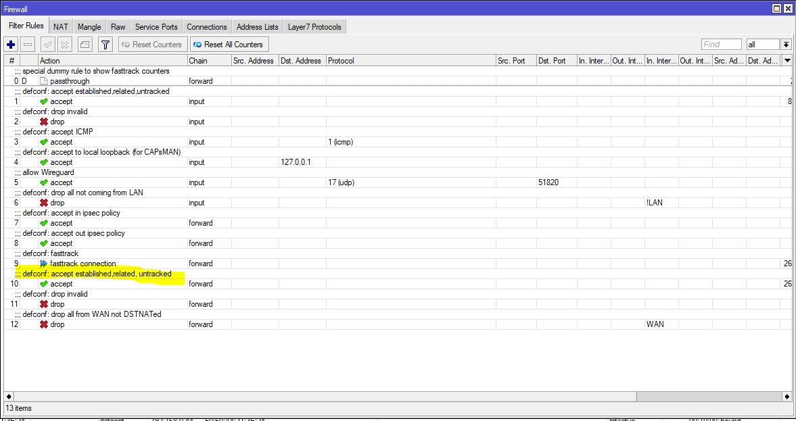
</figure>

Con esto ya tendremos creada nuestra VPN, ahora a configurar los clientes

:fontawesome-brands-telegram:{ .telegram } <small> @sermayoral</small> 

### Configurando Wireguard en Android

Busca la app de Wireguard en Google Play y la instalas:

<figure markdown> 
  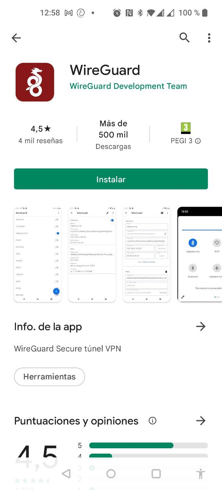{ width="300" }
</figure>

Pues ahora creas una nueva configuración desde cero:

<figure markdown> 
  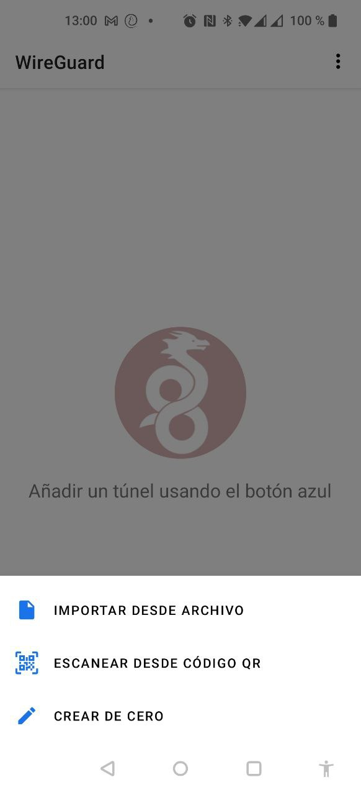{ width="300" }
</figure>

Os aparecerá la siguiente pantalla:

<figure markdown> 
  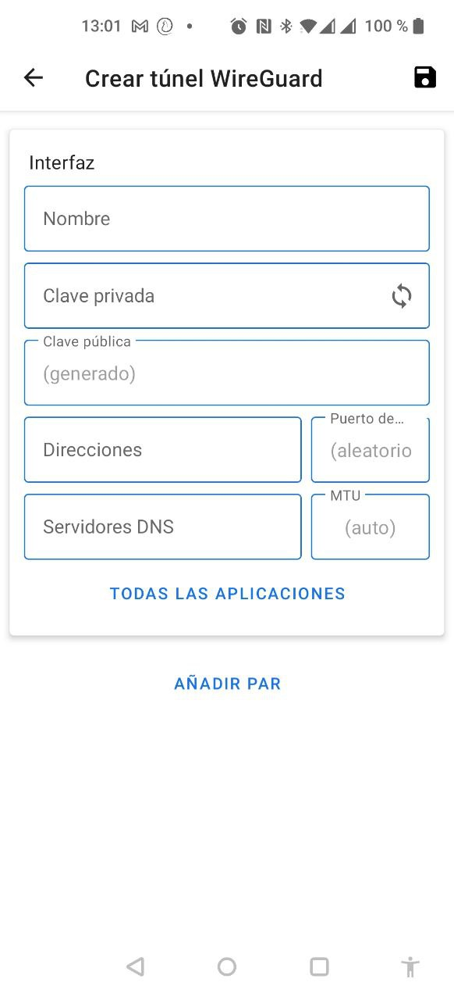{ width="300" }
</figure>

Se completan los siguientes datos:

* **Nombre**: el que queráis para identificarlo.
* **Clave Privada/Clave Pública**: dejáis que la aplicación las genere por ti, pulsa el icono :octicons-sync-16:, n o te olvides de dejar guardada la clave pública generada por el móvil.
* **Direcciones**: esta es la dirección del otro lado del túnel. En el router configuramos la 192.168.90.1, así
     que aquí configuraremos la 192.168.90.2/32, si luego creais otro cliente (por ejemplo en el portatil, o en el movil de la señora, pues le dais la 192.168.90.3/32 (y así en adelante) 
* **Puerto**: no hace falta que lo rellenéis, lo dejaremos en blanco para que lo genere él en caliente (total, soy
    un cliente, no servidor).
* **MTU**: lo dejamos en automático.
* **Servidores DNS**: esto sí es importante, le damos la IP que vamos a querer usar como DNS. En mi caso, como tengo un servidor DNS dentro de la red local, le doy una IP del otro extremo del túnel, de mi red local, a la que está conectada este router haciendo de switch. En vuestro caso, podéis poner la propia IP del router principal de vuestra red, que normalmente ya hace de servidor DNS, o unas DNS públicas, tipo las de cloudflare: 1.1.1.1, 1.0.0.1. En el caso de que tengas un servidor tipo AdGuard o Pi Hole primero pones la IP de tu servidor y luego la de to Router, sepáralos con comas.

El cliente está listo. Bajando un poco en la app, ahora pulsamos en **Añadir Pares**, para dar de alta el detalle del par del otro extremo, nuestro servidor. Y rellenamos con los siguientes datos:
* **Clave Pública**: metemos la clave pública que se generó en el router en el primer paso, cuando dimos de alta la interfaz de wireguard. Enviaos el chorizo por correo sin miedo, no me seáis animales y lo copiéis a mano letra a letra. Es una clave pública, se puede enviar de manera insegura sin mayor problema.
* **Clave Precompartida:** lo dejamos en vacío
* **Punto Final**: aquí va la IP pública de nuestra conexión o nuestro dominio ddns, seguido de dos puntos y el puerto elegido. Es decir, algo así: **serial.sn.mynetname.net:51820**, donde, como siempre, serial es el número de serie de vuestro equipo mikrotik que tenga activo el servicio de ddns (IP -> Cloud). Verificar que IP Cloud esté enabled, si no no os funcionaría, claro.
* **IPS Permitidas**: 0.0.0.0/0

Ahora guardamos nuestra configuración pulsando arriba a al derecha en el icono del disco.

Con las mismas, hemos terminado con el cliente. ¿qué nos queda? Pues dar de alta este peer en el otro extremo, para permitirle conectar con el servidor. Vamos a ello, volvemos de nuevo al mikrotik y ejecutamos:

```
/interface/wireguard/peers/add interface=wireguard allowed-address=192.168.90.2/32 public-key="CHORIZO" comment="movil-felipe"
```
Siendo "CHORIZO" la clave pública que hemos generado en el móvil, y que nos hemos anotado previamente. Ojo y meterla entre comillas, que no tengáis problemas con caracteres especiales como el "=", muy típico en este tipo de claves.

:fontawesome-brands-telegram:{ .telegram } <small> @sermayoral</small> 

### Configurando Wireguard en PC

Para usar la VPN wireguard en tu PC, <a href="https://www.wireguard.com/install/" target="_blank"> descárgate el cliente Wireguard</a>

Añade un nuevo tunel vacío:

<figure markdown> 
  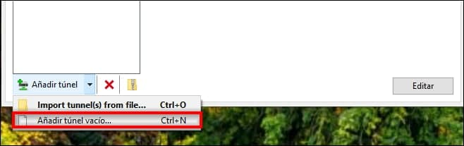
</figure>

Os aparecerá una ventana y completáis el nombre:

<figure markdown> 
  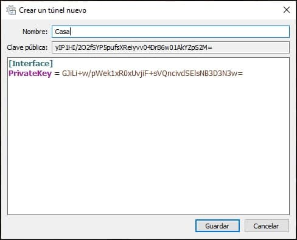
</figure>

Y añadís el siguiente texto:


```
Address = 192.168.90.3/32
DNS = LAS MISMAS QUE PUSISTEIS EN EL CLIENTE DEL MOVIL
[Peer]
PublicKey = CLAVE PUBLICA DEL SERVIDOR VPN
AllowedIPs = 0.0.0.0/0
Endpoint = BLABLABLA.sn.mynetname.net:51820
```

  * **Address**: para el cliente vpn del movil pusimos la 192.168.90.2/32 así que para este pues hemos elegido, por ejemplo, la 192.168.90.3/32
  * **DNS**: esto sí es importante, le damos la IP que vamos a querer usar como DNS. En mi caso, como tengo un servidor DNS dentro de la red local, le doy una IP del otro extremo del túnel, de mi red local, a la que está conectada este router haciendo de switch. En vuestro caso, podéis poner la propia IP del router principal de vuestra red, que normalmente ya hace de servidor DNS, o unas DNS públicas, tipo las de cloudflare: 1.1.1.1, 1.0.0.1. En el caso de que tengas un servidor tipo AdGuard o Pi Hole primero pones la IP de tu servidor y luego la de to Router, sepáralos con comas.
  * **PublicKey**: metemos la clave pública que se generó en el router en el primer paso, cuando dimos de alta la interfaz de wireguard. Enviaos el chorizo por correo sin miedo, no me seáis animales y lo copiéis a mano letra a letra. Es una clave pública, se puede enviar de manera insegura sin mayor problema, si no sabes como, [mira como conseguirla](#creando-servidor-vpn).
  * **Endpoint**: aquí va la IP pública de nuestra conexión o nuestro dominio ddns, seguido de dos puntos y el puerto elegido. Es decir, algo así: **serial.sn.mynetname.net:51820**, donde, como siempre, serial es el número de serie de vuestro equipo mikrotik que tenga activo el servicio de ddns (IP -> Cloud). Verificar que IP Cloud esté enabled, si no no os funcionaría, claro.
* **AllowedIPs**: 0.0.0.0/0


Con esto ya tendríamos la parte del cliente en windows. Ya solo nos quedaría añadir el peer correspondiente a la parte servidora. Esto es igual que lo que hicimos cuando lo configuramos en el movil. No varía la clave pública del cliente (que es la que tendréis que añadir al peer de la parte servidora) se encuenta aquí:

<figure markdown> 
  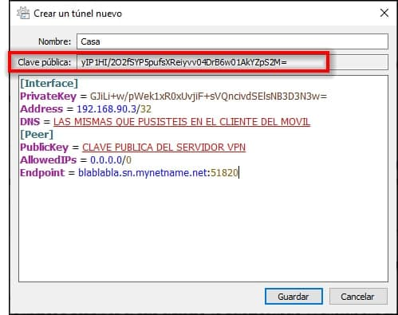
</figure>

Vale, pues vamos a crear un nuevo peer en la parte servidora (router Mikrotik), y añadirle la clave pública que indico en la captura, hemos dicho que para este cliente vamos a usar la IP 192.168.90.3/32

```
/interface/wireguard/peers/add interface=wireguard allowed-address=192.168.90.3/32 public-key="PUBLICKEY_CLIENTE" comment="portatil-felipe"
```
Y con esto ya estaría creado nuestro tunel en el PC.

:fontawesome-brands-telegram:{ .telegram } <small> @sermayoral</small> 


### Permitir acceso al router desde los clientes conectados a la VPN

Como habrás podido ver si ya tienes configurado tu VPN, te darás cuenta de que no puedes acceder a tu Mikrotik, para poder hacerlo, tan solo tendreis que añadir la interfaz de wireguard a la lista de interfaz LAN del router, con el siguiente comando:

```
/interface/list/member/add interface=wireguard list=LAN
```

:fontawesome-brands-telegram:{ .telegram } <small> @sermayoral</small> 

### Permitir acceso al router desde los clientes conectados a la VPN (Personalizado)

Es una alternativa a este [tutorial](#permitir-acceso-al-router-desde-los-clientes-conectados-a-la-vpn) permite que TODOS los clientes conectados a la VPN puedan acceder al router y es totalmente válido.

Pero si queréis hacer cosas como por ejemplo: *"Yo y solo yo, desde mi movil y mi portatil, puedo acceder al router, pero mi mujer y mis hijos NO quiero que accedan al router. Con que puedan acceder a HA y al NAS es más que suficiente"*.

Entonces podréis conseguirlo con esto que os voy a indicar, lo primero de todo, si es que ya hicisteis el tutorial para que TODOS los clientes conectados a la VPN puedan acceder al router, sería deshacer esa regla, esto mejor hacerlo por la interfaz gráfica, muy sencillo, menú **Interfaces :material-arrow-right: Interface List** (pestaña), pulsar con el boton derecho sobre la interfaz wireguard que está en la lista LAN y eliminarla:

<figure markdown> 
  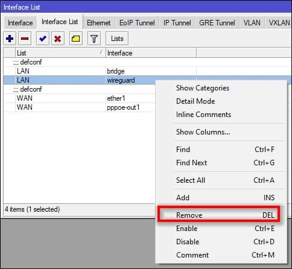
</figure>

Ahora habríamos vuelto al paso de que cualquier cliente conectado a la vpn verá HA, verá el NAS, los shellies, pero NO podrá acceder al router, bien, ahora vamos a crear una lista personalizada de IPs que puedan acceder al router, siguiendo con los ejemplos anteriores, partimos de una VPN configurada en la subred 192.168.90.1, y los clientes de esta VPN tendrán como IPs 192.168.90.2 ... hasta donde lleguemos.

La lista se crea en el menú **IP :material-arrow-right: Firewall :material-arrow-right: Address Lists** (Pestaña), le dais al + para crear una lista nueva, la llamáis como queráis (en mi caso wireguard-admins) y le añadís las IPs de la VPN que queráis que tengan acceso al router:

<figure markdown> 
  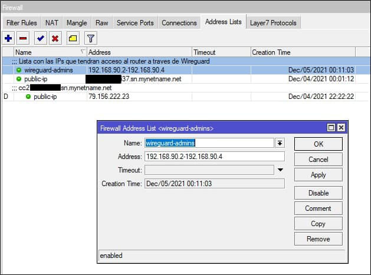
</figure>

En Address se puede poner una IP, o un rango como en mi caso, si queréis añadir varias IPs sin usar rango, tendréis que crear primero la lista con una única IP (por ejemplo 192.168.90.2) y guardarlo, luego tendríais que añadir otra nueva lista, con el mismo nombre que la anterior, y con la nueva IP a añadir.

En mi caso, por simplicidad, he definido un rango como el que muestro en la captura, y así tengo una única entrada, podéis, por ejemplo, definir un rango de IPs de la 192.168.90.2-192.168.90.100 para administradores.

Cuando configureis un nuevo cliente de Wireguard, si queréis que acceda al router, le dais una IP inferior a la 192.168.90.100, y si NO queréis que acceda al router, le dáis una IP superior a la 192.168.90.100, y listo.

Pues con esto ya tenemos creada la lista de IPs que tendrán acceso al router. Ahora nos queda meter la regla en el firewall para que permita esto:

```
/ip firewall filter
add action=accept chain=input comment="allow admins from Wireguard" src-address-list=wireguard-admins place-before [find comment="defconf: drop all not coming from LAN"]
```

En dicho comando modificar wireguard-admins por el nombre que le hayáis dado a la lista de IPs que tendrán acceso al router, y listo, con eso ya tenéis acceso personalizado al router desde Wireguard.

:fontawesome-brands-telegram:{ .telegram } <small> @sermayoral</small> 