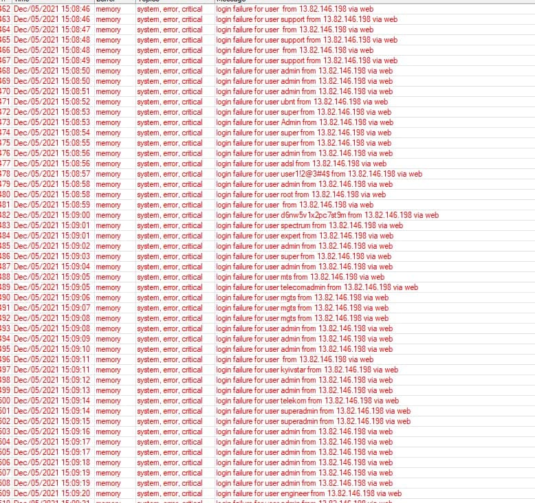

# Mikrotik

¿El router de tu operadora, se ha quedado corto?, ¿tienes problemas con el wifi de tu casa?, ¿y no puedes asignas mas IPs fijas?. Mikrotik es tu respuesta, los routers de la operadora son bastante básico, y para unos poco dispositivos es suficiente, pero que pasa cuando empiezas a tener bastantes dispositivos, tu red se vuelve inmanejable.

Podrás usar un Mikrotik, siempre y cuando puedas deshacerte del router de tu operadora, o puedas poner tu router en modo Bridge, de tal manera que toda la gestión de la red se la pasas al Mikrotik.

!!! warning "A tener en cuenta, la interfaz de usuario de Mikrotik no es nada amigable, y es de nivel avanzado, por lo que no te esperes menús sencillos y asistentes, requiere de paciencia y entender que estás haciendo, desde el grupo te echaremos una mano"

## ¿Que alternativas tengo?

Según las experiencias del grupo, hay varias alternativas:

### Usar un Mikrotik MikroTik Hex RB750Gr3  + AP Unifi

Con esta combinación, podrás el router Mikrotik gestionará tu red, y el [Punto de Acceso Ubitiqui](ubitiqui.md) gestionará toda tu red wifi.

<figure markdown> 
  
  <figcaption>Mikrotik Hex Lite</figcaption>
</figure>

Tiene un precio de <a href="https://www.amazon.es/gp/product/B01MSUMVUB/ref=ox_sc_act_title_1?smid=A1CSD37BFGDG5P&psc=1" target="_blank">** 50.87€ **</a>


### Usar un Mikrotik HAP AC2 ###

Con este Router podrás tener todo en uno, por un lado podrás gestionar tu red, y por otro lado la red Wifi, hay que tener en cuenta que el Wifi de Mikrotik no es de lo mejor del mercado en cuanto alcance, por lo que si en la última habitación de tu casa no te llega el Wifi, con el AP AC2 tampoco te va a llegar.

<figure markdown> 
  { width="150" }
  <figcaption>Mikrotik Hex Lite</figcaption>
</figure>

Tiene un precio de <a href="https://www.amazon.es/gp/product/B079SD8NVQ/ref=ox_sc_act_title_1?smid=A2RB1QEU2VOSLR&psc=1" target="_blank">** 62.33€ **</a>

### Usar tu propio Router y una red Zigbee ###

Si aun así no quieres cambiar el Router de tu operadora, puedes usar el mayor número de dispositivos con una red Wifi Zigbee alternativa. 

## Cómo tener tu red local en cualquier

¿Te gustaría poder llevarte tu red local a cuestas?, esto es posible, necesitas de hardware adicional (Hap Mini),para ello sigue el tutorial siguiente realizado por Pocoyo en el foro ADSLAyuda.


<figure markdown> 
  { width="200" }
  <figcaption>Hap Mini <a href="https://www.amazon.es/gp/product/B079SD8NVQ/ref=ox_sc_act_title_1?smid=A2RB1QEU2VOSLR&psc=1" target="_blank">21€</figcaption>
</figure>


!!! info "<a href="https://www.adslzone.net/foro/mikrotik.199/manual-mikrotik-tuneles-eoip-como-llevarte-tu-red-cuestas.520975/" target="_blank">** Tutorial **</a>"

## Conecta tu movil Android a tu router

¿Te has quedado sin internet en el router? tienes alternativas, puedes conectar tu móvil Android a tu Router Mikrotik y tener internet, estos son los pasos que has de seguir:

!!! info "<a href="https://blog.ligos.net/2017-08-16/Mikrotik-And-LTE-via-Android.html" target="_blank">** Conectar móvil Android a Mikrotik **</a>"

## Usar dominio de Mikrotik para acceder a Home Assistant (SSL)

Decir primero que el requisito de conocimientos para realizar esto es saber abrir puestos en Mikrotik para el caso del Hairpin NAT (o NAT Loopback). 

Desinstalar o parar el addon de DuckDNS. Ya no vamos a usarlo

Abrir el puerto 80 tcp externo y redireccionarlo al puerto 80 de nuestra host (rpi, nuc o lo que tengais). Este paso es necesario para poder securizar nuestro dominio con el addon Let's Encrypt. Suponiendo que vuestro host esté en la ip 192.168.2.10, el comando para abrir el puerto en Mikrotik sería el siguiente:

```
/ip firewall nat
add action=dst-nat chain=dstnat comment=Hassio-LetsEncrypt dst-address-list=public-ip dst-port=80 protocol=tcp to-addresses=192.168.2.10 to-ports=80
```
Instala el addon de Lets Encrypt desde la Add-on Store del menú Supervisor y configúrarlo de la siguiente manera:

```yaml
email: '!secret email_sergio'
domains:
 - '!secret home_domain'
 certfile: fullchain.pem
 keyfile: privkey.pem
 challenge: http
 dns: {}

```
*!secret home_domain será vuestro DDNS de Mikrotik sin https, que es del tipo blablabla.sn.mynetname.net*

El mail es necesario para poder generar los certificados (lo guarda let's encrypt en su base de datos), de tal manera que cuando  tu certificado esta a punto a finalizar te mandan correo, este addon automatiza la renovación de los certificados. Una vez configurado, ejecutarlo y mirar el log para ver que ha securizado correctamente.

Una vez securizado vuestro dominio, tan solo quedaría especificarlo en el addon de NGINX Proxy. Esta sería la configuracion del addon:

```yaml
domain: '!secret home_domain'
certfile: fullchain.pem
keyfile: privkey.pem
hsts: max-age=31536000; includeSubDomains
cloudflare: false
customize:
  active: false
  default: nginx_proxy_default*.conf
  servers: nginx_proxy/*.conf
```

*Donde secret_home_domain es vuestro DDNS de Mikrotik, es decir, el mismo que configurasteis en el addon de Lets Encrypt*

Una vez modificado, reiniciais el addon, y podríais acceder a vuestra instancia de HA securizada escribiendo: [nombredominio.sn.mynetname.net](nombredominio.sn.mynetname.net)

## Abrir puertos

Si quieres abrir puertos en este router es bastante sencillo, para ello lo primero de todo será habilitar el Hairpin Nat (Nat Loopback).

Esta opción nos valdrá para acceder a una máquina local (tipo un NAS o un webserver) usando un dominio público, cuando estemos dentro de nuestra propia red. En los routers comerciales al uso, normalmente esto ya viene implementado, y es algo por lo que no nos tenemos que preocupar. No obstante, en routers más avanzados, es una opción que hay que configurar a mano. La configuración básica, para una única máquina y un único puerto, la tenéis explicada en la wiki. No obstante, vamos a darle una vuelta de tuerca y a configurar esto para que el loopback funcione para todo el segmento de red y que, además, no tengamos que andar editando la regla de apartura de puertos del hairpin cada vez que necesitemos exponer un puerto nuevo. Para ello, vamos a hacer uso de una propiedad relativamente nueva en los routers mikrotik, llamada address-llists.

Primero, activamos el dominio ddns (primer truco):

```
/ip cloud set ddns-enabled=yes
```

Segundo, añadiremos nuestro dominio como una lista de direcciones, la cual vamos a llamar public-ip. Al hacerlo, el propio router resolverá nuestra IP pública, a la cual apunta el dominio.

```
/ip firewall address-list add address=[/ip cloud get dns-name] list=public-ip
```
Crearemos la siguiente regla de masquerade en el NAT, la cual colocaremos en la primera posición, antes que la regla por defecto (posición 0), obteniendo nuestra LAN dinámicamente. Suponemos que, si no se ha cambiado, nuestra LAN por defecto es la que se define en la primera entrada de "networks" en el servidor DHCP:

```
/ip firewall nat add action=masquerade chain=srcnat comment=hairpin-nat dst-address=[/ip dhcp-server network get 0 address] src-address=[/ip dhcp-server network get 0 address] place-before=0
```

Por último, creamos la apertura de puertos que queramos, pero con una pequeña modificación: ahora le diremos que el tráfico viene por nuestra IP pública. Al no tener una IP pública estática, no podremos usarla en el dst-address, pero como hemos creado la entrada en la lista de direcciones, podemos usar el dst-address-list como filtro. De esta manera no secuestramos todo el tráfico de nuestra red para ese puerto en cuestión, sino sólo el de entrada (el que tiene como destino la IP pública)
En este caso, abriremos el tráfico del puerto 443 externo (HTTPS) y lo redireccionaremos a la al puerto https de la consola de administración de nuestro equipo (supongo un servidor web situado en la IP 192.168.88.100 y con puerto de administración el 1234). Adaptar el ejemplo a vuestras necesidades:

```
/ip firewall nat
add action=dst-nat chain=dstnat comment=Web-Admin dst-address-list=public-ip \
dst-port=443 protocol=tcp to-addresses=192.168.88.100 to-ports=443
```
Para comprobar si los tienes activados, abre Winbox y ve a la opción de menú **IP :material-arrow-right: Firewall :material-arrow-right: NAT**, deberá aparecer el puerto abierto:


<figure markdown> 
  
</figure>

Si haces doble click en la regla, con la ip que hayas definido, te deberá aparecer esto:

<figure markdown> 
  
</figure>


**Fuente:** <a href="https://www.adslzone.net/foro/mikrotik.199/manual-mikrotik-tips-tricks.548449/" target="_blank"> Foro ADSLZONE </a>

## Crear tu primer backup en la nube

Para ello abre la consola de tu Mikrotik y ejecuta el siguiente comando, deberás de usara una contraseña:

```
/system backup cloud upload-file action=create-and-upload password=tu_contraseña
```

Visualizar el detalle del backup, incluida la clave de descarga del fichero (por si os queréis llevar la configuración a otro equipo)

```
/system backup cloud print
```

Descargar el backup en el propio equipo - Se descargará en Files y podréis restaurarlo con la contraseña de encriptado que pusisteis al crearlo [tu_contraseña]

```
/system backup cloud download-file action=download number=0
```

Descargarlo en otro equipo - Necesitaréis el secret-download-key que se proporciona por consola en el segundo paso, cuando mostramos la info del backup

```
/system backup cloud download-file action=download secret-download-key=XXXXXXXXX
```

Borrar el backup, para dejar el espacio libre y crear uno nuevo

```
/system backup cloud remove-file 0

```

**Fuente:** <a href="https://www.adslzone.net/foro/mikrotik.199/manual-mikrotik-tips-tricks.548449/" target="_blank"> Foro ADSLZONE - PocoYo </a>

## Crear y planificar backups de tu equipo

Una vez hecho y asumido el primer [backup en cloud](#crear-tu-primer-backup-en-la-nube), lo que vamos a hacer es muy simple, y se divide en dos pasos:

**Creación de script**

Vamos a crear un script que elimine el backup que ya está en los servidores, que cree uno nuevo y que lo suba a los servidores de MikroTik, de nuevo.

Para ello usa la interfaz Winbox y selecciona la opción de menú **System :material-arrow-right: Scripts**.

Añadís un script con el botón **+** y le ponéis el nombre que queráis, por ejemplo: **crear-backup-cloud**, con los siguientes permisos:

<figure markdown> 
  
</figure>

Y abajo del todo, en el cuadro **source**, pegáis este código, modificando la password por una de vuestro gusto:

```
/log info message="cloud backup started"
/system backup cloud upload-file action=create-and-upload password=miSuperPassword replace=[/system backup cloud get 0 name]
/log info message="cloud backup finished"
```

Esto sería haciéndolo por la interfaz, yo lo hice así, pero bueno, si queréis que se cree con un solo comando de terminal, este sería el comando:

```
/system script
add comment="Actualiza un backup en la nube de Mikrotik" dont-require-permissions=yes name=crear-backup-cloud owner=admin policy=\
  read,write,test,password source="/log info message=\"cloud backup started\"\r\
    \n/system backup cloud upload-file action=create-and-upload password=miSuperPassword replace=[/system backup cloud get 0 name]\r\
    \n/log info message=\"cloud backup finished\"\r\
    \n"
```    
Pues ya está. Y ya sea a través de interfaz, o por comando de terminal, ya tenéis vuestro script que os actualiza un backup en cloud con vuesta configuración en el router.

**Planificar la ejecución del script recien creado**

Para este paso recomiendo la interfaz, osea, Winbox, ya que es muy intuitivo. En realidad los dos pasos los hice yo por interfaz, pero este más aun.

Seleccionáis menú **System :material-arrow-right: Scheduler**, creáis una nueva planificación con el botón **+**, y le ponéis un nombre, por ejemplo: *planificador-backup-cloud*

Día de inicio, el que queráis, que significa que lo hará a partir de ese día, antes de ese día no. Si por ejemplo ponéis un dia de la semana pasada ahí, o del año pasado, pues comenzará a hacerlo hoy mismo, luego la hora a la que queréis que lo haga y el intervalo de frecuencia que queréis que lo haga.

Con respecto a los permisos, serían los mismos que antes, pero podéis quitar el de la password, porque la planificación en si no lleva contraseña.

Ya faltaría lo más importante, en el campo "on event", especificar el nombre del script que creamos en el paso 1, quedando de esta forma:

<figure markdown> 
  
</figure>

Aplicais, guardáis, y ya tenéis planificado un backup recurrente de la configuración de vuestro MikroTik, en mi caso diario, y alojado en los servidores de MikroTik.

## Recuperar backup en la nube

Ha ocurrido lo que no esperabas, has tocado donde no debías, y tu Mikrotik ya no funciona como antés, menos mal que tienes creados los [backups automáticos en la nube](#crear-y-planificar-backups-de-tu-equipo), vamos a descargar nuestro backup y restaurar nuestro router.

Para ello ejecuta el siguiente comando en la terminal de Mikrotik:

```
/system backup cloud download-file action=download number=0
```

Tras un rato descargará, ahora si vas a la opción de menú **Files** veras tu fichero descargado, ahora solo te queda seleccionar el fichero, darle al botón **Restore**, meter la contraseña (si los tienes encriptados), y tu router se reiniciará con al configuración de tu backup.

<figure markdown> 
  
</figure>

## Firewall en Mikrotik

Por defecto los Router Mikrotik vienen con un firewall por defecto que evita que atacantes o personas externas puedan acceder a tu router, si por error las borras o las modificas, puede que recibas intentos de acceso, para ello puedes revisar el log, menú **log**.

<figure markdown> 
  { width="300" }
</figure>
<figcaption>Intentos de acceso a to Router</figcaption>

Si es así vete a la opción de menú **IP  :material-arrow-right: Firewall**, selecciona la pestaña **Filter Rules** y booras lo que tengas, y a continuación en la **Terminal**, ejecutas el siguiente comando:

```
/ip firewall nat add chain=srcnat out-interface-list=WAN ipsec-policy=out,none action=masquerade comment="defconf: masquerade"
                     /ip firewall {
                       filter add chain=input action=accept connection-state=established,related,untracked comment="defconf: accept established,relate>
                       filter add chain=input action=drop connection-state=invalid comment="defconf: drop invalid"
                       filter add chain=input action=accept protocol=icmp comment="defconf: accept ICMP"
                       filter add chain=input action=accept dst-address=127.0.0.1 comment="defconf: accept to local loopback (for CAPsMAN)"
                       filter add chain=input action=drop in-interface-list=!LAN comment="defconf: drop all not coming from LAN"
                       filter add chain=forward action=accept ipsec-policy=in,ipsec comment="defconf: accept in ipsec policy"
                       filter add chain=forward action=accept ipsec-policy=out,ipsec comment="defconf: accept out ipsec policy"
                       filter add chain=forward action=fasttrack-connection connection-state=established,related comment="defconf: fasttrack"
                       filter add chain=forward action=accept connection-state=established,related,untracked comment="defconf: accept established,rela>
                       filter add chain=forward action=drop connection-state=invalid comment="defconf: drop invalid"
                       filter add chain=forward action=drop connection-state=new connection-nat-state=!dstnat in-interface-list=WAN comment="defconf: >
                     }
```

Si ha ido todo bien, verás las reglas de tu Firewall con algo parecido a esto:

<figure markdown> 
  
</figure>