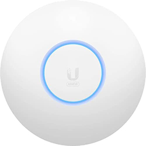

# Todo sobre el punto de acceso Ubitiqui

¿Tienes problemas de Wifi?, ¿no te llega la conexión al rincón oscuro te tu casa?, ¿usas extensores y la calidad de tu red wifi es pésima?, Ubitiqui esta la solución a todos tus problemas.

## ¿Que es?

Ubitiqui es una compañía de redes que posee diferentes productos para mejorar tu red wifi, es una de las mejores soluciones para ampliar tu red wifi sin perder apenas calidad y velocidad de conexión.

<figure markdown> 
  
  <figcaption>El famoso "ovni"</figcaption>
</figure>

## ¿Que productos nos interesan?

Principalmente nos interesan los puntos de accesos (AP), ya que estos serán los encargados de distribuir nuestra wifi por toda nuestra casa, estos AP necesitan de un cable de red (que vendrá de tu router) y una alimentación (POE).

**Dispone de dos productos:**

=== "Access Point WiFi 6 Lite"

    * Wifi 6
    * Banda 5 GHz (2x2 MU-MIMO y OFDMA) a una máximo de 1.2 Gbps de transmisión
    * Banda 2.4 GHz (2x2 MIMO) a un máximo de 300 Mbps de transmisión
    * Dispone de POE
    * Precio: <a href="https://www.amazon.es/Ubiquiti-UAP-AC-LITE-Punto-de-acceso-dual-radio-Blanco/dp/B016K4GQVG/ref=cm_wl_huc_item?th=1" target="_blank">** 85.62€ **</a>
    
=== "Access Point WiFi 6 Long-Range"

    * Wifi 6
    * Banda 5 GHz (4x4 MU-MIMO y OFDMA) a una máximo de 2.4 Gbps de transmisión
    * Banda 2.4 GHz (4x4 MIMO) a un máximo de 600 Mbps de transmisión
    * Dispone de POE
    * Más alcance que el Wifi 6 Lite
    * Precio: <a href="https://eu.store.ui.com/products/unifi-6-long-range-access-point-1" target="_blank">** 150€ **</a>

## Mejora tu red Wifi con Ubitiqui

Siempre que sea posible, aumentar el ancho del canal de la red 5g a 80mhz, si perdieras cobertura en zonas lejanas, te tocaría bajarlo, ya que cuanto mas ancho, mas datos puede transmitir, pero mas se deteriora la señal con los obstaculos, cada instalacion es diferente y debes probar.

Lo mejor para elegir el canal del wifi 5g es analizar que hay en tu entorno y siempre que sea posible, elegir el canal mas bajo posible ya que es mas *robusto* aunque aqui, aconsejo encarecidamente que se deje en auto, ya que el propio ap, analizará cual es el mejor a usar en todo momento y si un vecino se planta en tu canal, el cambiará a otro para darte la mejor calidad.

Depende del Access Point (ap de aqui en adelante), se entrará de una manera u otra, esto está hecho desde el controlador de ubiquiti, aunque todos los ap suelen tener estas opciones, algunos lo traen activado de casa y otros como en este caso, hay que activarlos.

La que mas se va a beneficiar de estos cambios será el 5g aprovechando todas las antenas del ap y del dispositivo que uses para conectarte al ap.

**Las opciones a activar:**

* UAPSD (Unscheduled Automatic Power Save Delivery)
* Multicast Enhancement (Permit devices to send multicast traffic to registered clients at higher data rates.)
* High Performance Devices (Connect high performance clients to 5 GHz only) este lo activo ya que en esta red, emito en  las 2 bandas, 2.4 y 5g asi obligo a que los dispositivos potentes se conecten a la 5g siempre que sea posible.
* BSS Transition (Allow BSS Transition with WNM) 
* Enable Fast Roaming (Faster roaming for modern devices with 802.11r compatibility. Older devices may experience connectivity issues) .Aqui si hariamos uso de la solucion propietaria de ubiquiti para el cambio rapido entre ap’s, **pero solo si tenemos mas de un ap**, si no, es innecesario activarlo.

!!! info "[**Video explicativo**](/videos/MejoraWifi.mov)"

:fontawesome-brands-telegram:{ .telegram } <small>@JaviLopezFotografia</small> 

## Mejora tu red de domótica

Para la red de domotica, yo personalmente uso solo una red de 2.4, en ancho de canal al minimo, a 20 (para aumentar cobertura y estabilidad) y en los ajustes:

* Activo el UAPSD (Unscheduled Automatic Power Save Delivery)
* BSS Transition (Allow BSS Transition with WNM) 
* Enable Fast Roaming (Faster roaming for modern devices with 802.11r compatibility. Older devices may experience connectivity issues)

Yo no he tenido ningun problema con mis dispositivos, en caso de notar cosas raras, desactivar este último, ya que es una solución propietaria de la marca para que los dispositivos hagan el roaming mucho mas rapido entre ap’s, bajando muchisimo el tiempo de asociación con el nuevo ap, ya que con el, son necesarios muchos menos paquetes de envio para asociarse… al ser la de domotica, son dispositivos que estan quietos, asi que el roaming, no deberian ni usarlo, ya que si la cobertura es buena, no seria necesario esa mejora, asi que si quereis este ultimo no es necesario, pero ahi esta por si quereis probar.

:fontawesome-brands-telegram:{ .telegram } <small>@JaviLopezFotografia</small> 