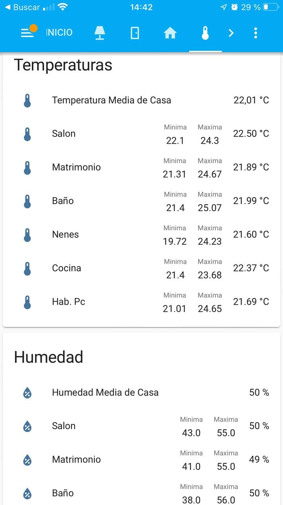

# Sensores para estar mejor

¿Tienes calor?, ¿tienes frío?, uff que pereza, tengo que levantarme a enceder la calefacción, ¿dónde está el mando del aire acondicionado?, ¡Aquí huele a cerrado!, hay que ventilar, pero ¿no hay mucha humedad?, se acabó, con estas automatizaciones te tendrás que olvidar de casi todo. Estas automatizaciones normalmente se ubican en el fichero **sensors.yaml**

## Media de temperatura o humedad

Sensor que saca la media de temperatura a partir de otros sensores. En este caso se divide por 5, ya que se utilizan 5 sensores para sacar la media.

??? tip "Requisitos"

    * Sensores de humedad o temperatura.

```yaml
- platform: template
  sensors:
      humedad_media_casa:
        friendly_name: Humedad Media de Casa
        unit_of_measurement: "%"
        icon_template: mdi:water-percent
        value_template: "{{ ((states('sensor.humedad_salon') | int(50) + 
                              states('sensor.humedad_h_matrimonio') | int(50) + 
                              states('sensor.humedad_h_nenes') | int(50) + 
                              states('sensor.humedad_cocina') | int(50) + 
                              states('sensor.humedad_h_pc') | int(50) ) /5) | round(0) }}"
```

:fontawesome-brands-telegram:{ .telegram } <small>@JaviLopezFotografia</small> 

## Estadísticas de un sensor

No te ha pasado nunca que te despiertas y dices, que frío y te preguntas, ¿cuanto habrá sido la temperatura mínima?, pues con **statistics** es fácil, creamos los siguiente sensores:

??? tip "Requisitos"

    * Sensores que hagan algún tipo de medición

Nos creamos los sensores de estadísticas, uno para la temperatura máxima y otro para la mínima:

```yaml
- platform: statistics
  entity_id: sensor.temperatura_bano
  state_characteristic: value_min
  max_age:
    hours: 24
  sampling_size: 600
  precision: 2
  name: stats_temperatura_bano_min
    
- platform: statistics
  entity_id: sensor.temperatura_bano
  state_characteristic: value_max
  max_age:
    hours: 24
  sampling_size: 600
  precision: 2
  name: stats_temperatura_bano_max
```

Si nos queremos hacer un panel como este:

<figure markdown> 
  { width="200" }
</figure>

** Código lovelace **

```yaml
type: entities
entities:
  - entity: sensor.temperatura_media_casa
  - entity: sensor.temperatura_salon
    type: custom:multiple-entity-row
    name: Salon
    entities:
      - sensor.salon_temp_min
      - sensor.salon_temp_max
  - entity: sensor.temperatura_h_matrimonio
    type: custom:multiple-entity-row
    name: Matrimonio
    entities:
      - sensor.matrimonio_temp_min
      - sensor.matrimonio_temp_max
  - entity: sensor.temperatura_bano
    type: custom:multiple-entity-row
    name: Baño
    entities:
      - sensor.bano_temp_min
      - sensor.bano_temp_max
  - entity: sensor.temperatura_h_nenes
    type: custom:multiple-entity-row
    name: Nenes
    entities:
      - sensor.nenes_temp_min
      - sensor.nenes_temp_max
  - entity: sensor.temperatura_cocina
    type: custom:multiple-entity-row
    name: Cocina
    entities:
      - sensor.cocina_temp_min
      - sensor.cocina_temp_max
  - entity: sensor.temperatura_h_pc
    type: custom:multiple-entity-row
    name: Hab. Pc
    entities:
      - sensor.h_pc_temp_min
      - sensor.h_pc_temp_max
title: Temperaturas
```

:fontawesome-brands-telegram:{ .telegram } <small>@JaviLopezFotografia</small> 
