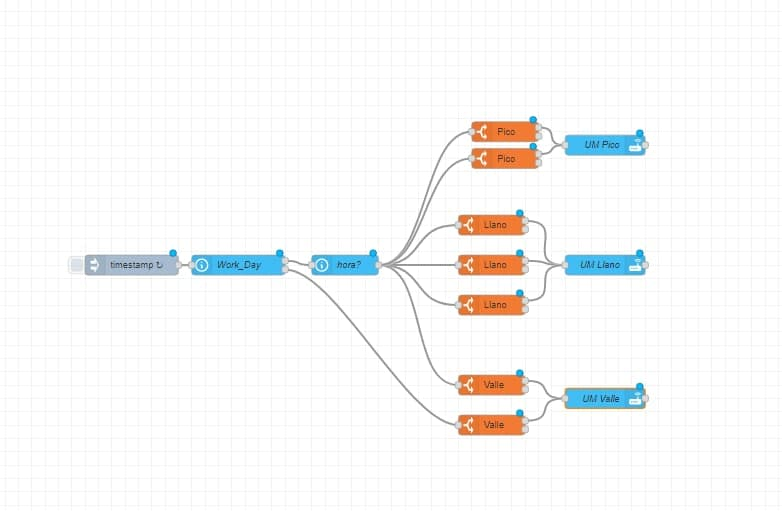
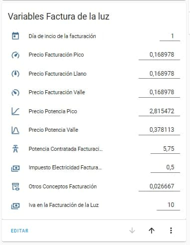
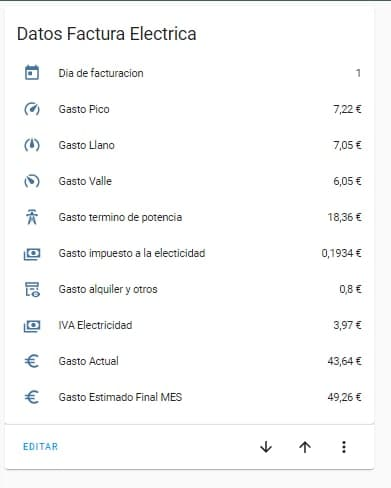

# Energía

Mide como nunca tu gasto energético, ¿cuantos Kw llevo gastados?, y la factura de la luz, ¿pagaré mas o menos que mes pasado?, ahora con estos sensores tu gasto energitico y de bolsillo controlado

## Datos factura electrónica

¿Te gustaría saber de antemano lo que gastarás este mes?, se acabaron los sustos, con estos sensores totalmente configurables podrás saber el importe de tu próxima factura, y no tener los sustos de siempre.

??? tip "Requisitos"

    * Un medidor de energía, normalmente un PZEM u otro sensor que mida el consumo total de tu casa.
    * <a href="https://community.home-assistant.io/t/home-assistant-community-add-on-node-red/55023" target="_blank">** Node-Red**</a>, se usa para hacer la automatización, aunque puedes hacerla con Home Assistant.

**Sensor de Kwh**

Lo primero es crearnos el sensor en kWh, si ya tenemos un sensor dispositivo que nos dá este dato no tendríamos que crearlo, este sensor se crea en **sensors.yaml**. <a href="https://www.home-assistant.io/integrations/integration/" target="_blank">Más información.</a>

```yaml
- platform: integration
  source: sensor.TU_SENSOR_EN_W
  name: NOMBRE IDENTIFICATIVO PARA TU SENSOR
  unit_prefix: k
  unit_time: h
  round: 3
  method: left
```

**Utility Meter**

Creamos con el utility_metter un sensor que nos vaya acumulando el consumo en los diferentes tramos. Este sensor se crea en **utility_meter.yaml**. <a href="https://www.home-assistant.io/integrations/utility_meter/" target="_blank">Más información.</a>

```yaml
energia_mensual:
  source: sensor.TU_SENSOR_EN_KWH     #creado en el paso anterior o el sensor de nuestro medidor
  cycle: monthly
  tariffs:
    - Pico
    - Llano
    - Valle
# si nuetro día de inicio de la facturación es diferenta al día 1 hay que añadir:
  offset:
    days: 5     #Dia del primer día de facturacion -1 (o ultimo día de la facturación, depende de como se mire....)
# si es el día 1 no hace falta ponerlo
```

** Sensores Workday y Time **

Para ello lo primero debemos de crear dos sensores, el sensor work_day (en binary_sensors.yaml), y el sensor de fecha y hora (en sensors.yaml). <a href="https://www.home-assistant.io/integrations/workday/" target="_blank">Más información.</a>

```yaml
##############################
##         WORK DAY         ##
##############################
         
- platform: workday
  country: ES
  province: PON_TU_PROVINCIA    # https://pypi.org/project/holidays/
  name: "workday"
  workdays: [mon, tue, wed, thu, fri]
  excludes: [sat, sun, holiday]
```

Sensor de fecha y hora, <a href="https://www.home-assistant.io/integrations/time_date/" target="_blank">más información.</a>

```yaml
##############################
##        FECHA-HORA        ##
##############################
          # https://www.home-assistant.io/integrations/time_date/
- platform: time_date
  display_options:
    - "time"
    - "date"
    - "date_time"
```    

** Automatización **

Creada con Node-Red, importamos:

```json
[{"id":"b00f8b7e87fa7cdf","type":"time-range-switch","z":"2419432f.a8e82c","name":"Pico","lat":"37.931895","lon":"-4.672891","startTime":"10:00","endTime":"14:00","startOffset":0,"endOffset":0,"x":990,"y":2680,"wires":[["4e7fdc401168cfa0"],[]]},{"id":"4a48334f1eea30f7","type":"time-range-switch","z":"2419432f.a8e82c","name":"Pico","lat":"37.931895","lon":"-4.672891","startTime":"18:00","endTime":"22:00","startOffset":0,"endOffset":0,"x":990,"y":2720,"wires":[["4e7fdc401168cfa0"],[]]},{"id":"f33f10d4a849e2ae","type":"time-range-switch","z":"2419432f.a8e82c","name":"Valle","lat":"37.931895","lon":"-4.672891","startTime":"00:00","endTime":"08:00","startOffset":0,"endOffset":0,"x":970,"y":3060,"wires":[["a5c1c794f781dff5"],[]]},{"id":"00f2c2eb94bd2967","type":"time-range-switch","z":"2419432f.a8e82c","name":"Llano","lat":"37.931895","lon":"-4.672891","startTime":"08:00","endTime":"10:00","startOffset":0,"endOffset":0,"x":970,"y":2820,"wires":[["81ce24ef90554c2d"],[]]},{"id":"d84198cd74953039","type":"time-range-switch","z":"2419432f.a8e82c","name":"Llano","lat":"37.931895","lon":"-4.672891","startTime":"14:00","endTime":"18:00","startOffset":0,"endOffset":0,"x":970,"y":2880,"wires":[["81ce24ef90554c2d"],[]]},{"id":"1b899dd4edb33f53","type":"time-range-switch","z":"2419432f.a8e82c","name":"Llano","lat":"37.931895","lon":"-4.672891","startTime":"22:00","endTime":"00:00","startOffset":0,"endOffset":0,"x":970,"y":2940,"wires":[["81ce24ef90554c2d"],[]]},{"id":"d3fdc7dbe59f22c4","type":"api-current-state","z":"2419432f.a8e82c","name":"hora?","server":"a696c0e8.5d63b","version":2,"outputs":1,"halt_if":"","halt_if_type":"str","halt_if_compare":"is","entity_id":"sensor.time","state_type":"str","blockInputOverrides":false,"outputProperties":[{"property":"payload","propertyType":"msg","value":"","valueType":"entityState"},{"property":"data","propertyType":"msg","value":"","valueType":"entity"}],"x":750,"y":2880,"wires":[["b00f8b7e87fa7cdf","00f2c2eb94bd2967","d84198cd74953039","1b899dd4edb33f53","f33f10d4a849e2ae","4a48334f1eea30f7"]]},{"id":"4e7fdc401168cfa0","type":"api-call-service","z":"2419432f.a8e82c","name":"UM Pico","server":"a696c0e8.5d63b","version":3,"debugenabled":false,"service_domain":"utility_meter","service":"select_tariff","entityId":"utility_meter.energia_diaria, utility_meter.energia_mensual, utility_meter.energia_horaria","data":"{\"tariff\":\"Pico\"}","dataType":"jsonata","mergecontext":"","mustacheAltTags":false,"outputProperties":[],"queue":"none","x":1140,"y":2700,"wires":[[]]},{"id":"81ce24ef90554c2d","type":"api-call-service","z":"2419432f.a8e82c","name":"UM Llano","server":"a696c0e8.5d63b","version":3,"debugenabled":false,"service_domain":"utility_meter","service":"select_tariff","entityId":"utility_meter.energia_diaria, utility_meter.energia_mensual, utility_meter.energia_horaria","data":"{\"tariff\":\"Llano\"}","dataType":"jsonata","mergecontext":"","mustacheAltTags":false,"outputProperties":[],"queue":"none","x":1120,"y":2880,"wires":[[]]},{"id":"a5c1c794f781dff5","type":"api-call-service","z":"2419432f.a8e82c","name":"UM Valle","server":"a696c0e8.5d63b","version":3,"debugenabled":false,"service_domain":"utility_meter","service":"select_tariff","entityId":"utility_meter.energia_diaria, utility_meter.energia_mensual, utility_meter.energia_horaria","data":"{\"tariff\":\"Valle\"}","dataType":"jsonata","mergecontext":"","mustacheAltTags":false,"outputProperties":[],"queue":"none","x":1120,"y":3080,"wires":[[]]},{"id":"2845bd64283b8474","type":"time-range-switch","z":"2419432f.a8e82c","name":"Valle","lat":"37.931895","lon":"-4.672891","startTime":"00:00","endTime":"23:59","startOffset":0,"endOffset":0,"x":970,"y":3120,"wires":[["a5c1c794f781dff5"],[]]},{"id":"7ffb0864f1677d56","type":"api-current-state","z":"2419432f.a8e82c","name":"Work_Day","server":"a696c0e8.5d63b","version":2,"outputs":2,"halt_if":"on","halt_if_type":"str","halt_if_compare":"is","entity_id":"binary_sensor.workday","state_type":"str","blockInputOverrides":false,"outputProperties":[{"property":"payload","propertyType":"msg","value":"","valueType":"entityState"},{"property":"data","propertyType":"msg","value":"","valueType":"entity"}],"override_topic":false,"state_location":"payload","override_payload":"msg","entity_location":"data","override_data":"msg","x":590,"y":2880,"wires":[["d3fdc7dbe59f22c4"],["2845bd64283b8474"]]},{"id":"a38a324a82a4357b","type":"inject","z":"2419432f.a8e82c","name":"","props":[{"p":"payload"},{"p":"topic","vt":"str"}],"repeat":"","crontab":"*/1 0-23 * * *","once":true,"onceDelay":0.1,"topic":"","payloadType":"date","x":410,"y":2880,"wires":[["7ffb0864f1677d56"]]},{"id":"a696c0e8.5d63b","type":"server","name":"Home Assistant","version":2,"addon":true,"rejectUnauthorizedCerts":true,"ha_boolean":"y|yes|true|on|home|open","connectionDelay":true,"cacheJson":true,"heartbeat":false,"heartbeatInterval":30}]
```


<figure markdown> 
  
   <figcaption>Automatización en Node-Red</figcaption>
</figure>

**Creación de las variables**

Con estas variables podrás introducir los datos de tu factura, estos sensores se crean en **input_number.yaml**.


```yaml
##################################
##      VARIABLES FACTURA LUZ   ##
##################################
  
  
dia_inicio_facturacion_luz:
  name: Día de incio de la facturación
  min: 0
  max: 31
  step: 1
  mode: box
  icon: mdi:calendar-today

precio_facturacion_pico:
  name: Precio Facturación Pico
  min: 0
  max: 10
  step: 0.000001
  mode: box
  icon: mdi:speedometer
  
precio_facturacion_llano:
  name: Precio Facturación Llano
  min: 0
  max: 10
  step: 0.000001
  mode: box
  icon: mdi:speedometer-medium
  
precio_facturacion_valle:
  name: Precio Facturación Valle
  min: 0
  max: 10
  step: 0.000001
  mode: box
  icon: mdi:speedometer-slow
 
precio_facturacion_potencia_pico:
  name: Precio Potencia Pico
  min: 0
  max: 10
  step: 0.000001
  mode: box
  icon: mdi:chart-bell-curve-cumulative
  
precio_facturacion_potencia_valle:
  name: Precio Potencia Valle
  min: 0
  max: 10
  step: 0.000001
  mode: box
  icon: mdi:chart-bell-curve
    
potencia_contratada_facturacion_luz:
  name: Potencia Contratada Facturación Luz
  min: 0
  max: 10
  step: 0.01
  mode: box
  icon: mdi:transmission-tower
  
impuesto_electricidad_facturacion_luz:
  name: Impuesto Electricidad Facturación
  min: 0
  max: 10
  step: 0.01
  mode: box
  icon: mdi:cash-multiple
    
otros_conceptos_facturacion_luz:
  name: Otros Conceptos Facturación
  min: 0
  max: 10
  step: 0.000001
  mode: box
  icon: mdi:archive-eye-outline
  
iva_facturacion_luz:
  name: Iva en la Facturación de la Luz
  min: 0
  max: 100
  step: 1
  mode: box
  icon: mdi:cash-multiple
```

**Creación de nuestra factura**

Ya queda menos, ahora nos creamos los sensores que harán los cálculos de la factura, como siempre en **sensors.yaml**

```yaml
#######################################################
########      Sensores de calculo factura      ########
#######################################################

- platform: template
  sensors:
  #Rellenar con los datos de vuestra factura
    gastoelectrico_diafactura:
      friendly_name: "Dia de facturacion"
      value_template: "{{ (states('input_number.dia_inicio_facturacion_luz'))|int }}"
      icon_template: mdi:calendar-today
                        #Dia de facturacion 

    gastoelectrico_pico:
      friendly_name: "Gasto Pico"
      unit_of_measurement: "€"
      value_template: "{{ ( states('input_number.precio_facturacion_pico')|float 
                        * (states('sensor.energia_mensual_pico')|float )) | round(2)  }}"
      icon_template: mdi:speedometer
                        #Precio Pico

    gastoelectrico_llano:
      friendly_name: "Gasto Llano"
      unit_of_measurement: "€"
      value_template: "{{  ( states('input_number.precio_facturacion_llano')|float 
                        * ( states('sensor.energia_mensual_llano')|float ) )| round(2)}}"
      icon_template: mdi:speedometer-medium
                        #Precio Llano

    gastoelectrico_valle:
      friendly_name: "Gasto Valle"
      unit_of_measurement: "€"
      value_template: "{{  ( states('input_number.precio_facturacion_valle')|float 
                         * ( states('sensor.energia_mensual_valle')|float ) ) | round(2)}}"
      icon_template: mdi:speedometer-slow
                      #Precio Valle 
    
    gastoelectrico_potencia:
      friendly_name: "Gasto termino de potencia"
      unit_of_measurement: "€"
      value_template: "{{  (( states('input_number.potencia_contratada_facturacion_luz')|float   
                            * (30)|int  
                            * (states('input_number.precio_facturacion_potencia_pico')|float / (30)|int )|float ) | round(2) )   
                        + (( states('input_number.potencia_contratada_facturacion_luz')|float   
                            * (30)|int  
                            * (states('input_number.precio_facturacion_potencia_valle')|float  / (30)|int )|float ) | round(2) ) }}"
      icon_template: mdi:transmission-tower
                            #Potencia Contratada  * DIAS * €/KW dia 

    gastoelectrico_impuesto_electicidad:
      friendly_name: "Gasto impuesto a la electicidad"
      unit_of_measurement: "€"
      value_template: "{{ ( states('input_number.impuesto_electricidad_facturacion_luz')|float / (100)|int ) 
                        * ( states('sensor.gastoelectrico_pico')|float + states('sensor.gastoelectrico_llano')|float 
                        + states('sensor.gastoelectrico_valle')|float + states('sensor.gastoelectrico_potencia')|float ) | round(2) }}"
      icon_template: mdi:cash-multiple
                        #Impuesto / 100  
    
    gastoelectrico_otros_conceptos:
      friendly_name: "Gasto alquiler y otros"
      unit_of_measurement: "€"
      value_template: "{{ ( states('input_number.otros_conceptos_facturacion_luz')|float   
                        * (30)|int )  | round(2) }}"
      icon_template: mdi:archive-eye-outline
      #Otros conceptos * DIAS 

    gastoelectrico_iva:
      friendly_name: "IVA Electricidad"
      unit_of_measurement: "€" 
      value_template: "{{  (  (states('input_number.iva_facturacion_luz')|float / (100)|int )|float   
                         *   (states('sensor.gastoelectrico_pico')|float 
                            + states('sensor.gastoelectrico_llano')|float 
                            + states('sensor.gastoelectrico_valle')|float 
                            + states('sensor.gastoelectrico_potencia')|float 
                            + states('sensor.gastoelectrico_impuesto_electicidad')|float 
                            + states('sensor.gastoelectrico_otros_conceptos')|float ) ) | round(2)  }}"
      icon_template: mdi:cash-multiple
                            #IVA * Gastos (consumo + potencia + impuesto + contador)


#######################################################
########             GASTO ACTUAL              ########
#######################################################

    gastoelectrico_actual:
      friendly_name: "Gasto Actual"
      unit_of_measurement: "€"
      value_template: "{{  ( states('sensor.gastoelectrico_pico')|float 
      + states('sensor.gastoelectrico_llano')|float 
      + states('sensor.gastoelectrico_valle')|float 
      + states('sensor.gastoelectrico_potencia')|float 
      + states('sensor.gastoelectrico_impuesto_electicidad')|float 
      + states('sensor.gastoelectrico_otros_conceptos')|float 
      + states('sensor.gastoelectrico_iva')|float ) | round(2)  }}"
      icon_template: mdi:currency-eur


#######################################################
########   ESTIMACIÓN FACTURA A FINAL DE MES   ########
#######################################################


    gastoelectrico_estimado: #Con dia de facturación
      friendly_name: "Gasto Estimado TOTAL"
      unit_of_measurement: "€"
      value_template: "
         
          {{ ( (1 + (states('input_number.iva_facturacion_luz')|float / (100)|int )|float) 
          * ( ((states('sensor.gastoelectrico_pico')|float / (now().day - (states('sensor.gastoelectrico_diafactura')|float))  ) * (30)|int ) 
            + ((states('sensor.gastoelectrico_llano')|float / (now().day - (states('sensor.gastoelectrico_diafactura')|float)) ) * (30)|int )
            + ((states('sensor.gastoelectrico_valle')|float / (now().day - (states('sensor.gastoelectrico_diafactura')|float)) ) * (30)|int ) 
            + states('sensor.gastoelectrico_potencia')|float  
            + ( states('input_number.impuesto_electricidad_facturacion_luz')|float / (100)|int ) 
                  *( ((states('sensor.gastoelectrico_pico')|float / (now().day - (states('sensor.gastoelectrico_diafactura')|float )) ) * (30)|int ) 
                    + ((states('sensor.gastoelectrico_llano')|float / (now().day - (states('sensor.gastoelectrico_diafactura')|float )) ) * (30)|int ) 
                    + ((states('sensor.gastoelectrico_valle')|float / (now().day - (states('sensor.gastoelectrico_diafactura')|float )) ) * (30)|int ) 
                    + states('sensor.gastoelectrico_potencia')|float )  
            + states('sensor.gastoelectrico_otros_conceptos')|float ) ) |round(2)}}

         
          {{ ( (1 + (states('input_number.iva_facturacion_luz')|float / (100)|int )|float) 
            * ( states('sensor.gastoelectrico_pico')|float 
                + states('sensor.gastoelectrico_llano')|float 
                + states('sensor.gastoelectrico_valle')|float 
                + states('sensor.gastoelectrico_potencia')|float  
                + ( states('input_number.impuesto_electricidad_facturacion_luz')|float / (100)|int ) 
                    * (states('sensor.gastoelectrico_pico')|float + states('sensor.gastoelectrico_llano')|float 
                      + states('sensor.gastoelectrico_valle')|float + states('sensor.gastoelectrico_potencia')|float )  
                      + states('sensor.gastoelectrico_otros_conceptos')|float ) ) |round(2)}}

        
          {{ ( (1 + (states('input_number.iva_facturacion_luz')|float / (100)|int )|float) 
          * ( ((states('sensor.gastoelectrico_pico')|float  / ( (30)|int - ((states('sensor.gastoelectrico_diafactura')|float) - now().day))  ) * (30)|int ) 
            + ((states('sensor.gastoelectrico_llano')|float / ( (30)|int - ((states('sensor.gastoelectrico_diafactura')|float) - now().day))  ) * (30)|int )
            + ((states('sensor.gastoelectrico_valle')|float / ( (30)|int - ((states('sensor.gastoelectrico_diafactura')|float) - now().day))  ) * (30)|int )
            + states('sensor.gastoelectrico_potencia')|float  
            +  ( states('input_number.impuesto_electricidad_facturacion_luz')|float / (100)|int ) *( ((states('sensor.gastoelectrico_pico')|float / ( (30)|int - ((states('sensor.gastoelectrico_diafactura')|int) - now().day))  ) * (30)|int) + ((states('sensor.gastoelectrico_llano')|float / ( (30)|int - ((states('sensor.gastoelectrico_diafactura')|float) - now().day)) ) * (30)|int ) + ((states('sensor.gastoelectrico_valle')|float / ( (30)|int - ((states('sensor.gastoelectrico_diafactura')|float) - now().day)) ) * (30)|int) + states('sensor.gastoelectrico_potencia')|float )  
            + states('sensor.gastoelectrico_otros_conceptos')|float ) ) |round(2)}}

        "
      icon_template: mdi:currency-eur
```

**Tarjetas de información en tu Home Assistant**

Si quieres tener una tarjeta para meter los valores de tu factura electrónica:

<figure markdown> 
  
   <figcaption>Valores de tu factura</figcaption>
</figure>

```yaml
type: entities
entities:
  - entity: input_number.dia_inicio_facturacion_luz
  - entity: input_number.precio_facturacion_pico
  - entity: input_number.precio_facturacion_llano
  - entity: input_number.precio_facturacion_valle
  - entity: input_number.precio_facturacion_potencia_pico
  - entity: input_number.precio_facturacion_potencia_valle
  - entity: input_number.potencia_contratada_facturacion_luz
  - entity: input_number.impuesto_electricidad_facturacion_luz
  - entity: input_number.otros_conceptos_facturacion_luz
  - entity: input_number.iva_facturacion_luz
title: Variables Factura de la luz
```

Y luego los datos de tu factura electrónica:

<figure markdown> 
  
   <figcaption>Factura electrónica</figcaption>
</figure>

```yaml
type: entities
entities:
  - entity: sensor.gastoelectrico_diafactura
  - entity: sensor.gastoelectrico_pico
  - entity: sensor.gastoelectrico_llano
  - entity: sensor.gastoelectrico_valle
  - entity: sensor.gastoelectrico_potencia
  - entity: sensor.gastoelectrico_impuesto_electicidad
  - entity: sensor.gastoelectrico_otros_conceptos
  - entity: sensor.gastoelectrico_iva
  - entity: sensor.gastoelectrico_actual
  - entity: sensor.gastoelectrico_estimado
title: Datos Factura Eléctrica
```
:fontawesome-brands-telegram:{ .telegram } <small> @rafajluque</small> 


   

    
